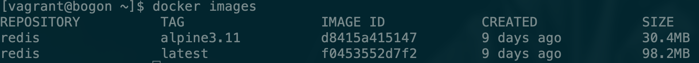
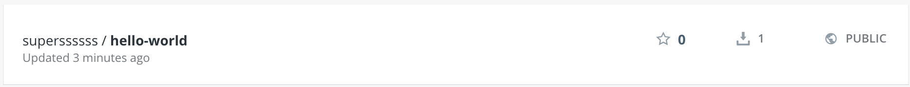

# Dive-into-Docker
动手学Docker

<div align = "center"><image src="./images/docker_logo.png" width = "300" height = "295" alt="axis" align=center /></div>

*注：建议使用Linux系统，这样更贴近生产环境。可以使用云服务器或者虚拟机等*

## content

- <a href = "#什么是Docker">什么是Docker</a>
- <a href = "#为什么要用Docker">为什么要用Docker</a>
- <a href = "#Docker安装">Docker安装</a>
- <a href = "#Docker初体验">Docker初体验</a>
- <a href = "#Docker三大基本概念">Docker三大基本概念</a>
  - <a href = "#镜像Image">镜像Image</a>
  - <a href = "#容器Container">容器Container</a>
  - <a href = "#仓库Repository">仓库Repository</a>
- <a href = "#镜像与容器操作">镜像与容器操作</a>
  - <a href = "#查看本地已经存在的image">查看本地已经存在的image</a>
  - <a href = "#如何获取image">如何获取image</a>
  - <a href="#删除image">删除image</a>
  - <a href = "#发布image">发布image</a>
  - <a href = "#生成container并进入container">生成container并进入container</a>
  - <a href = "#停止和重启container">停止和重启container</a>
  - <a href = "#删除container">删除container</a>
  - <a href = "#flask案例实战">flask案例实战</a>
  - <a href = "#Docker练习场">Docker练习场</a>

- <a href = "#参考文献">参考文献</a>


## [什么是Docker](#content)

> **Docker** 最初是 `dotCloud` 公司创始人 [Solomon Hykes](https://github.com/shykes) 在法国期间发起的一个公司内部项目，它是基于 `dotCloud` 公司多年云服务技术的一次革新，并于 [2013 年 3 月以 Apache 2.0 授权协议开源](https://en.wikipedia.org/wiki/Docker_(software))，主要项目代码在 [GitHub](https://github.com/moby/moby) 上进行维护。`Docker` 项目后来还加入了 Linux 基金会，并成立推动 [开放容器联盟（OCI）](https://www.opencontainers.org/)。
>
> **Docker** 自开源后受到广泛的关注和讨论，至今其 [GitHub 项目](https://github.com/moby/moby) 已经超过 5 万 4 千个星标和一万多个 `fork`。甚至由于 `Docker` 项目的火爆，在 `2013` 年底，[dotCloud 公司决定改名为 Docker](https://www.docker.com/blog/dotcloud-is-becoming-docker-inc/)。`Docker` 最初是在 `Ubuntu 12.04` 上开发实现的；`Red Hat` 则从 `RHEL 6.5` 开始对 `Docker` 进行支持；`Google` 也在其 `PaaS` 产品中广泛应用 `Docker`。
>
> **Docker** 使用 `Google` 公司推出的 [Go 语言](https://golang.org/) 进行开发实现，基于 `Linux` 内核的 [cgroup](https://zh.wikipedia.org/wiki/Cgroups)，[namespace](https://en.wikipedia.org/wiki/Linux_namespaces)，以及 [OverlayFS](https://docs.docker.com/storage/storagedriver/overlayfs-driver/) 类的 [Union FS](https://en.wikipedia.org/wiki/Union_mount) 等技术，对进程进行封装隔离，属于 [操作系统层面的虚拟化技术](https://en.wikipedia.org/wiki/Operating-system-level_virtualization)。由于隔离的进程独立于宿主和其它的隔离的进程，因此也称其为容器。最初实现是基于 [LXC](https://linuxcontainers.org/lxc/introduction/)，从 0.7 版本以后开始去除 `LXC`，转而使用自行开发的 [libcontainer](https://github.com/docker/libcontainer)，从 1.11 开始，则进一步演进为使用 [runC](https://github.com/opencontainers/runc) 和 [containerd](https://github.com/containerd/containerd)。
>
> 
>
> > `runc` 是一个 Linux 命令行工具，用于根据 [OCI容器运行时规范](https://github.com/opencontainers/runtime-spec) 创建和运行容器。
> >
> > `containerd` 是一个守护程序，它管理容器生命周期，提供了在一个节点上执行容器和管理镜像的最小功能集。
>
> **Docker** 在容器的基础上，进行了进一步的封装，从文件系统、网络互联到进程隔离等等，极大的简化了容器的创建和维护。使得 `Docker` 技术比虚拟机技术更为轻便、快捷。
>
> 下面的图片比较了 **Docker** 和传统虚拟化方式的不同之处。传统虚拟机技术是虚拟出一套硬件后，在其上运行一个完整操作系统，在该系统上再运行所需应用进程；而容器内的应用进程直接运行于宿主的内核，容器内没有自己的内核，而且也没有进行硬件虚拟。因此容器要比传统虚拟机更为轻便。
>
> 
>
> 

## [为什么要用Docker](#content)

> 作为一种新兴的虚拟化方式，`Docker` 跟传统的虚拟化方式相比具有众多的优势。
>
> ## 更高效的利用系统资源
>
> 由于容器不需要进行硬件虚拟以及运行完整操作系统等额外开销，`Docker` 对系统资源的利用率更高。无论是应用执行速度、内存损耗或者文件存储速度，都要比传统虚拟机技术更高效。因此，相比虚拟机技术，一个相同配置的主机，往往可以运行更多数量的应用。
>
> ## 更快速的启动时间
>
> 传统的虚拟机技术启动应用服务往往需要数分钟，而 `Docker` 容器应用，由于直接运行于宿主内核，无需启动完整的操作系统，因此可以做到秒级、甚至毫秒级的启动时间。大大的节约了开发、测试、部署的时间。
>
> ## 一致的运行环境
>
> 开发过程中一个常见的问题是环境一致性问题。由于开发环境、测试环境、生产环境不一致，导致有些 bug 并未在开发过程中被发现。而 `Docker` 的镜像提供了除内核外完整的运行时环境，确保了应用运行环境一致性，从而不会再出现 *「这段代码在我机器上没问题啊」* 这类问题。
>
> ## 持续交付和部署
>
> 对开发和运维（[DevOps](https://zh.wikipedia.org/wiki/DevOps)）人员来说，最希望的就是一次创建或配置，可以在任意地方正常运行。
>
> 使用 `Docker` 可以通过定制应用镜像来实现持续集成、持续交付、部署。开发人员可以通过 [Dockerfile](https://yeasy.gitbooks.io/docker_practice/image/dockerfile) 来进行镜像构建，并结合 [持续集成(Continuous Integration)](https://en.wikipedia.org/wiki/Continuous_integration) 系统进行集成测试，而运维人员则可以直接在生产环境中快速部署该镜像，甚至结合 [持续部署(Continuous Delivery/Deployment)](https://en.wikipedia.org/wiki/Continuous_delivery) 系统进行自动部署。
>
> 而且使用 [`Dockerfile`](https://yeasy.gitbooks.io/docker_practice/image/build.html) 使镜像构建透明化，不仅仅开发团队可以理解应用运行环境，也方便运维团队理解应用运行所需条件，帮助更好的生产环境中部署该镜像。
>
> ## 更轻松的迁移
>
> 由于 `Docker` 确保了执行环境的一致性，使得应用的迁移更加容易。`Docker` 可以在很多平台上运行，无论是物理机、虚拟机、公有云、私有云，甚至是笔记本，其运行结果是一致的。因此用户可以很轻易的将在一个平台上运行的应用，迁移到另一个平台上，而不用担心运行环境的变化导致应用无法正常运行的情况。
>
> ## 更轻松的维护和扩展
>
> `Docker` 使用的分层存储以及镜像的技术，使得应用重复部分的复用更为容易，也使得应用的维护更新更加简单，基于基础镜像进一步扩展镜像也变得非常简单。此外，`Docker` 团队同各个开源项目团队一起维护了一大批高质量的 [官方镜像](https://hub.docker.com/search/?type=image&image_filter=official)，既可以直接在生产环境使用，又可以作为基础进一步定制，大大的降低了应用服务的镜像制作成本。
>
> ## 对比传统虚拟机总结
>
> | 特性       | 容器               | 虚拟机      |
> | :--------- | :----------------- | :---------- |
> | 启动       | 秒级               | 分钟级      |
> | 硬盘使用   | 一般为 `MB`        | 一般为 `GB` |
> | 性能       | 接近原生           | 弱于        |
> | 系统支持量 | 单机支持上千个容器 | 一般几十个  |
>
> 通过Docker可以实现一次封装，到处运行**。

## [Docker安装](#content)

关于Docker的安装较为简单，mac和windows都有对应的安装包，Linux上也有每一步详细的安装步骤。


详情请参考官网：[Docker文档官网](https://docs.docker.com/)

---

国内可能在下载镜像时较慢，可以使用国内镜像加速：

以CentOS7为例，请在 /etc/docker/daemon.json 中写入如下内容（如果文件不存在请新建该文件）

```json
{
  "registry-mirrors": [
    "https://dockerhub.azk8s.cn",
    "https://hub-mirror.c.163.com"
  ]
}
```

注意，一定要保证该文件符合 json 规范，否则 Docker 将不能启动。

之后重新启动服务。

```bash
$ sudo systemctl daemon-reload
$ sudo systemctl restart docker
```


**若想要快速练习Docker，可以使用Docker在线版本：[Play with Docker](https://labs.play-with-docker.com/)，环境的保存时间有限**

## [Docker初体验](#content)

我们用Docker来搭建一个wordpress站点。执行之前确保电脑已经安装docker-compose,[安装步骤](https://docs.docker.com/compose/install/)。在mac和windows上安装Docker时会自动安装docker-compose，Linux上需要手动安装。


首先创建一个`docker-compose.yml`文件。

```dockerfile
version: '3'

services:

  wordpress:
    image: wordpress
    ports:
      - 8080:80
    depends_on:
      - mysql
    environment:
      WORDPRESS_DB_HOST: mysql
      WORDPRESS_DB_PASSWORD: root
    networks:
      - my-bridge

  mysql:
    image: mysql:5.7
    environment:
      MYSQL_ROOT_PASSWORD: root
      MYSQL_DATABASE: wordpress
    volumes:
      - mysql-data:/var/lib/mysql
    networks:
      - my-bridge

volumes:
  mysql-data:

networks:
  my-bridge:
    driver: bridge
```

然后在将终端切到文件所在的目录下，执行`docker-compose up`命令。


等待安装完成后，在浏览器输入`执行命令的机器的ip地址:8000`就可以看到wordpress的安装界面。


再对比一下不使用Docker方式：[安装wordpress](https://codex.wordpress.org/zh-cn:安装_WordPress)。你就能立刻对比出使用Docker的好处，而且如果后期存在站点迁移或更换服务器等操作，使用传统方法的开销是巨大的。

## [Docker三大基本概念](#content)

### [镜像Image](#content)

Image文件可以看作是我们要使用的运行环境的一个模版。任何两台电脑都安装了Docker的话，只要你们使用的image相同，那么加载出来的container就是相同的。Docker的Image是分层的，通过改变某层就可以形成一个新的镜像

每个镜像可能会有很多个版本的tag。


### [容器Container](#content)

Docker通过Image加载出来的就是容器，其实质是一个进程，所以它可以拥有自己独立的文件系统，网络等等。我们可以将我们的整体开发环境打包成镜像，在服务器上将此镜像加载为容器，对外界提供服务，就像刚才的那个wordpess案例一样。

### [仓库Repository](#content)

> ### Docker Registry
>
> 镜像构建完成后，可以很容易的在当前宿主机上运行，但是，如果需要在其它服务器上使用这个镜像，我们就需要一个集中的存储、分发镜像的服务，[Docker Registry](https://yeasy.gitbooks.io/docker_practice/repository/registry.html) 就是这样的服务。
>
> 一个 **Docker Registry** 中可以包含多个 **仓库**（`Repository`）；每个仓库可以包含多个 **标签**（`Tag`）；每个标签对应一个镜像。
>
> 通常，一个仓库会包含同一个软件不同版本的镜像，而标签就常用于对应该软件的各个版本。我们可以通过 `<仓库名>:<标签>` 的格式来指定具体是这个软件哪个版本的镜像。如果不给出标签，将以 `latest` 作为默认标签。
>
> 以 [Ubuntu 镜像](https://hub.docker.com/_/ubuntu) 为例，`ubuntu` 是仓库的名字，其内包含有不同的版本标签，如，`16.04`, `18.04`。我们可以通过 `ubuntu:16.04`，或者 `ubuntu:18.04` 来具体指定所需哪个版本的镜像。如果忽略了标签，比如 `ubuntu`，那将视为 `ubuntu:latest`。
>
> 仓库名经常以 *两段式路径* 形式出现，比如 `jwilder/nginx-proxy`，前者往往意味着 Docker Registry 多用户环境下的用户名，后者则往往是对应的软件名。但这并非绝对，取决于所使用的具体 Docker Registry 的软件或服务。
>
> ### Docker Registry 公开服务
>
> Docker Registry 公开服务是开放给用户使用、允许用户管理镜像的 Registry 服务。一般这类公开服务允许用户免费上传、下载公开的镜像，并可能提供收费服务供用户管理私有镜像。
>
> 最常使用的 Registry 公开服务是官方的 [Docker Hub](https://hub.docker.com/)，这也是默认的 Registry，并拥有大量的高质量的官方镜像。除此以外，还有 [CoreOS](https://coreos.com/) 的 [Quay.io](https://quay.io/repository/)，CoreOS 相关的镜像存储在这里；Google 的 [Google Container Registry](https://cloud.google.com/container-registry/)，[Kubernetes](https://kubernetes.io/) 的镜像使用的就是这个服务。
>
> 由于某些原因，在国内访问这些服务可能会比较慢。国内的一些云服务商提供了针对 Docker Hub 的镜像服务（`Registry Mirror`），这些镜像服务被称为**加速器**。常见的有 [阿里云加速器](https://cr.console.aliyun.com/#/accelerator)、[DaoCloud 加速器](https://www.daocloud.io/mirror#accelerator-doc) 等。使用加速器会直接从国内的地址下载 Docker Hub 的镜像，比直接从 Docker Hub 下载速度会提高很多。在 [安装 Docker](https://yeasy.gitbooks.io/docker_practice/install/mirror.html) 一节中有详细的配置方法。
>
> 国内也有一些云服务商提供类似于 Docker Hub 的公开服务。比如 [网易云镜像服务](https://c.163.com/hub#/m/library/)、[DaoCloud 镜像市场](https://hub.daocloud.io/)、[阿里云镜像库](https://cr.console.aliyun.com/) 等。
>
> ### 私有 Docker Registry
>
> 除了使用公开服务外，用户还可以在本地搭建私有 Docker Registry。Docker 官方提供了 [Docker Registry](https://hub.docker.com/_/registry/) 镜像，可以直接使用做为私有 Registry 服务。在 [私有仓库](https://yeasy.gitbooks.io/docker_practice/repository/registry.html) 一节中，会有进一步的搭建私有 Registry 服务的讲解。
>
> 开源的 Docker Registry 镜像只提供了 [Docker Registry API](https://docs.docker.com/registry/spec/api/) 的服务端实现，足以支持 `docker` 命令，不影响使用。但不包含图形界面，以及镜像维护、用户管理、访问控制等高级功能。在官方的商业化版本 [Docker Trusted Registry](https://docs.docker.com/datacenter/dtr/2.0/) 中，提供了这些高级功能。
>
> 除了官方的 Docker Registry 外，还有第三方软件实现了 Docker Registry API，甚至提供了用户界面以及一些高级功能。比如，[Harbor](https://github.com/goharbor/harbor) 和 [Sonatype Nexus](https://yeasy.gitbooks.io/docker_practice/repository/nexus3_registry.html)。

---

关于以上概念更多内容请看：[基本概念](https://yeasy.gitbooks.io/docker_practice/basic_concept/)

## [镜像与容器操作](#content)

若使用Linux操作Docker时，发现Docker没有启动们可以使用命令

```bash
sudo service docker start
```

来启动Docker服务。

### [查看本地已经存在的image](#content)

```bash
docker image ls
#或者docker images
```

因为Docker的架构与虚拟机不同，所以Docker可以在不同的Image之间共享层，这样可以尽可能的少占用存储空间。

### [如何获取image](#content)

- 通过`docker pull`从远程仓库拉取镜像
- 通过Dockerfile构建镜像

1.使用docker pull方式例如我们想获取redis的镜像，我们可以通过命令

```bash
docker pull redis
```

我们在拉取镜像时也可以指定版本号，否则默认是拉取最新的latest镜像。

```bash
docker pull redis:alpine3.11
```

通过docker images再显示拉取下来的镜像



2.使用Dockerfile方式

我们这里使用c语言编写一个hello world程序，之后将该程序打包到Docker image中。

首先创建单独的文件夹存放与Dockerfile相关的文件,创建hello.c文件，并将其编译为可执行文件hello

```c
#include<stdio.h>

int main(){
    printf("Hello World\n");
}
```

使用命令进行编译。在centos上通过命令安装编译环境：

```bash
sudo yum install gcc
sudo yum install glibc-static
```

将文件编译为可执行文件

```bash
gcc -static ello.c -o hello
```

创建并编辑Dockerfile内容（此处的文件并不规范，仅作为快速上手使用）

```dockerfile
FROM scratch
ADD hello /
CMD ["/hello"]
```

现在我们来看一下目录下的所有文件


根据此Dockerfile创建镜像

```bash
docker build -t su/hello-world .
```

其中`-t`之后代表我们要生成镜像的标记，最后有一个`.`不要忘记，代表当前文件夹下。

我们再使用docker images便可以查看到我们刚才创建的image。


关于更多Dockerfile语法规则请查看：[Dockerfile 指令详解](https://yeasy.gitbooks.io/docker_practice/image/dockerfile/)

### [删除image](#content)

使用如下命令删除redis拉取的redis镜像，命令中的redis也可以修改为redis对应的Image ID。

```bash
docker image rm redis
#或者docker rmi redis
```

### [发布image](#content)

为了将我们自己创建的image发布，我们需要在Docker Hub上注册账号，并且在生成镜像时，-t后面要接Docker Hub用户名/镜像名称。我们已经生成了一个新的hello world镜像。


首先通过docker login命令登陆。


推送自己的镜像到Docker Hub上

```bash
docker push superssssss/hello-world:latest
```

**注意你在使用过程中需要将superssssss修改为自己的账户名，`:`后面接的是镜像版本。**



我们就可以在Docker Hub上查看到刚才push上去的镜像了。

TODO:

关联Github自动构建。

### [生成container并进入container](#content)

我们先加载一下刚才我们自己创建的image，通过一下命令运行

```bash
docker run su/hello-world
```

我们可以看到输出结果


刚才使用`docker run`命令就是将我们创建的hello-world镜像加载成容器运行。

我们通过此命令可以查看到container的运行情况

```bash
docker container ls -a
#或者docker	ps -a
```

因为通过此方式创建的容器运行完会直接退出，所以需要加上`-a`参数。


---

我们在来看一个centos的案例。

```bash
docker run -d centos /bin/bash
```

我们本地虽然没有centos的镜像，但是如果我们直接run的话，docker会自动从网上将centos的镜像拉取下来，并加载成容器，其中的`-d`参数会使当前的容器转为后台执行，我们可以使用命令来查看一下容器状态。


在`STATUS`一栏可以查看容器的状态，现在centos这个镜像是`UP`状态。然后再通过`docker exec`命令进入容器

```bash
docker exec -it b6a /bin/bash
```

其中`-it`参数可以使终端以交互式的运行，并执行`/bin/bash`命令，b6a就可以代表这个centos容器对应的CONTAINER ID。


进入容器之后我们就可以配置我们需要的环境或者安装需要的服务。

在终端中输入`exit`退出容器。

### [停止和重启container](#content)

对于现在运行的container我们可以使其停止运行或者将已经停止的container重新启动

```bash
docker container stop b6a
docker container start b6a
```


### [删除container](#content)

对于我们已经不再需要的容器，我们可以将其删除。

```bash
docker container rm b6a
#或者docker rm b6a
```


### [flask案例实战](#content)

本案例我们使用python的flask框架搭建一个简易的可访问的网站。

首先编写python程序，文件名为app.py

```python
from flask import Flask
app = Flask(__name__)
@app.route('/')
def hello():
    return "hello docker\n"
if __name__ == '__main__':
    app.run(host="0.0.0.0", port=5000)
```

之后编写Dockerfile文件

```dockerfile
FROM python:2.7
LABEL maintainer="123<123@gmail.com>"
RUN pip install flask
COPY app.py /app/
WORKDIR /app
EXPOSE 5000
CMD ["python", "app.py"]

```

这个Dockerfile包含更多的内容，我们这个Dockerfile是以`python:2.7`为基础镜像，其中`maintainer`为此Dockerfile文件的维护人员，方便其他使用者联系。接下来的`RUN`命令安装了flask框架，`COPY`命令将文件夹下的app.py拷贝到镜像文件下的`/app/`目录下，并通过`WORKDIR`命令将当前的工作目录设置为`/app`，并将镜像的5000端口`EXPOSE`开放出去提供访问，最后的`CMD`命令执行这个app.py文件。我们来看一下现在文件夹下存在哪些内容


然后构建一下镜像，需要一段时间。

```bash
docker build -t superssssss/flask-hello .
```


然后我们将镜像加载为容器运行

```bash
docker run -d -p 5000:5000 superssssss/flask-hello
```

`-p`参数将容器的5000端口映射到电脑的5000端口，这样通过`电脑的ip地址:5000`就可以访问这个容器提供的服务了。


### [Docker练习场](#content)

学习完以上内容，大家可以参加一下阿里天池的[Docker练习场](https://tianchi.aliyun.com/competition/entrance/231759/introduction)比赛，更进一步熟悉Docker操作。

我的提交在：[tianchi_submit](#content)

## [参考文献](#content)

[1] 阮一峰：[Docker 入门教程](https://www.ruanyifeng.com/blog/2018/02/docker-tutorial.html)

[2] yeasy: [Docker从入门到实战](https://yeasy.gitbooks.io/docker_practice/introduction/what.html)