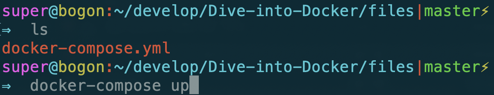
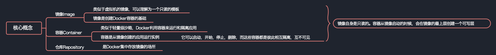
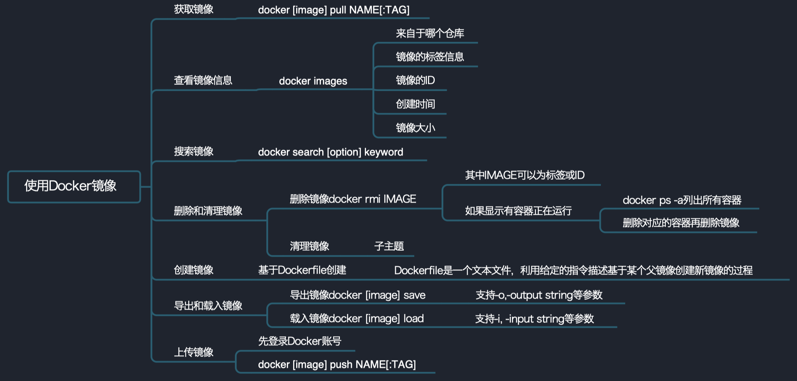
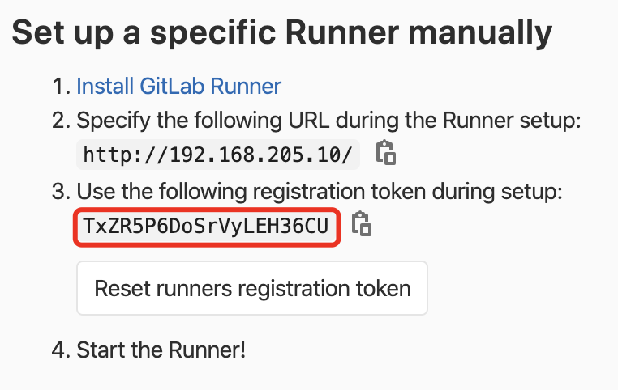
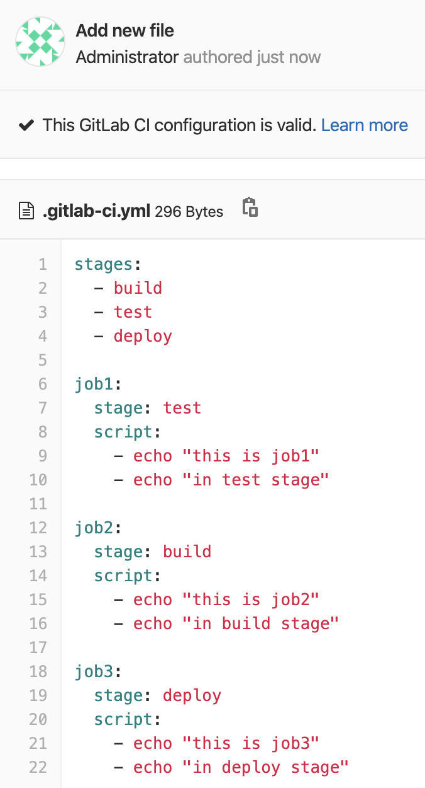

# Dive-into-Docker
动手学Docker

<div align = "center"><image src="./images/docker_logo.png" width = "300" height = "295" alt="axis" align=center /></div>

*注：建议使用Linux系统，这样更贴近生产环境。可以使用云服务器或者虚拟机等*

## content

- <a href = "#什么是Docker">什么是Docker</a>
- <a href = "#为什么要用Docker">为什么要用Docker</a>
- <a href = "#Docker安装">Docker安装</a>
- <a href = "#Docker初体验">Docker初体验</a>
- <a href = "#Docker三大基本概念">Docker三大基本概念</a>
  - <a href = "#镜像Image">镜像Image</a>
  - <a href = "#容器Container">容器Container</a>
  - <a href = "#仓库Repository">仓库Repository</a>
- <a href = "#镜像与容器操作">镜像与容器操作</a>
  - <a href = "#查看本地已经存在的image">查看本地已经存在的image</a>
  - <a href = "#如何获取image">如何获取image</a>
  - <a href="#删除image">删除image</a>
  - <a href = "#发布image">发布image</a>
  - <a href = "#生成container并进入container">生成container并进入container</a>
  - <a href = "#停止和重启container">停止和重启container</a>
  - <a href = "#删除container">删除container</a>
  - <a href = "#flask案例实战">flask案例实战</a>
  - <a href = "#Docker练习场">Docker练习场</a>
- <a href = "#Docker网络">Docker网络</a>
  - <a href = "#Docker单机网络">Docker单机网络</a>
  - <a href = "#Docker端口映射">Docker端口映射</a>
  - <a href = "#flask-redis实战">flask-redis实战</a>
  - <a href = "#Docker多机网络">Docker多机网络</a>
  - <a href = "#flask-redis多机实战">flask-redis多机实战</a>
- <a href = "#Docker数据持久化存储">Docker数据持久化存储</a>
- <a href = "#Docker多容器部署">Docker多容器部署</a>
- <a href = "#容器编排">容器编排</a>
- <a href = "#CI/CD">CI/CD</a>
- <a href = "#参考文献">参考文献</a>


## [什么是Docker](#content)

> **Docker** 最初是 `dotCloud` 公司创始人 [Solomon Hykes](https://github.com/shykes) 在法国期间发起的一个公司内部项目，它是基于 `dotCloud` 公司多年云服务技术的一次革新，并于 [2013 年 3 月以 Apache 2.0 授权协议开源](https://en.wikipedia.org/wiki/Docker_(software))，主要项目代码在 [GitHub](https://github.com/moby/moby) 上进行维护。`Docker` 项目后来还加入了 Linux 基金会，并成立推动 [开放容器联盟（OCI）](https://www.opencontainers.org/)。
>
> **Docker** 自开源后受到广泛的关注和讨论，至今其 [GitHub 项目](https://github.com/moby/moby) 已经超过 5 万 4 千个星标和一万多个 `fork`。甚至由于 `Docker` 项目的火爆，在 `2013` 年底，[dotCloud 公司决定改名为 Docker](https://www.docker.com/blog/dotcloud-is-becoming-docker-inc/)。`Docker` 最初是在 `Ubuntu 12.04` 上开发实现的；`Red Hat` 则从 `RHEL 6.5` 开始对 `Docker` 进行支持；`Google` 也在其 `PaaS` 产品中广泛应用 `Docker`。
>
> **Docker** 使用 `Google` 公司推出的 [Go 语言](https://golang.org/) 进行开发实现，基于 `Linux` 内核的 [cgroup](https://zh.wikipedia.org/wiki/Cgroups)，[namespace](https://en.wikipedia.org/wiki/Linux_namespaces)，以及 [OverlayFS](https://docs.docker.com/storage/storagedriver/overlayfs-driver/) 类的 [Union FS](https://en.wikipedia.org/wiki/Union_mount) 等技术，对进程进行封装隔离，属于 [操作系统层面的虚拟化技术](https://en.wikipedia.org/wiki/Operating-system-level_virtualization)。由于隔离的进程独立于宿主和其它的隔离的进程，因此也称其为容器。最初实现是基于 [LXC](https://linuxcontainers.org/lxc/introduction/)，从 0.7 版本以后开始去除 `LXC`，转而使用自行开发的 [libcontainer](https://github.com/docker/libcontainer)，从 1.11 开始，则进一步演进为使用 [runC](https://github.com/opencontainers/runc) 和 [containerd](https://github.com/containerd/containerd)。
>
> 
>
> > `runc` 是一个 Linux 命令行工具，用于根据 [OCI容器运行时规范](https://github.com/opencontainers/runtime-spec) 创建和运行容器。
> >
> > `containerd` 是一个守护程序，它管理容器生命周期，提供了在一个节点上执行容器和管理镜像的最小功能集。
>
> **Docker** 在容器的基础上，进行了进一步的封装，从文件系统、网络互联到进程隔离等等，极大的简化了容器的创建和维护。使得 `Docker` 技术比虚拟机技术更为轻便、快捷。
>
> 下面的图片比较了 **Docker** 和传统虚拟化方式的不同之处。传统虚拟机技术是虚拟出一套硬件后，在其上运行一个完整操作系统，在该系统上再运行所需应用进程；而容器内的应用进程直接运行于宿主的内核，容器内没有自己的内核，而且也没有进行硬件虚拟。因此容器要比传统虚拟机更为轻便。
>
> 
>
> 

## [为什么要用Docker](#content)

> 作为一种新兴的虚拟化方式，`Docker` 跟传统的虚拟化方式相比具有众多的优势。
>
> ## 更高效的利用系统资源
>
> 由于容器不需要进行硬件虚拟以及运行完整操作系统等额外开销，`Docker` 对系统资源的利用率更高。无论是应用执行速度、内存损耗或者文件存储速度，都要比传统虚拟机技术更高效。因此，相比虚拟机技术，一个相同配置的主机，往往可以运行更多数量的应用。
>
> ## 更快速的启动时间
>
> 传统的虚拟机技术启动应用服务往往需要数分钟，而 `Docker` 容器应用，由于直接运行于宿主内核，无需启动完整的操作系统，因此可以做到秒级、甚至毫秒级的启动时间。大大的节约了开发、测试、部署的时间。
>
> ## 一致的运行环境
>
> 开发过程中一个常见的问题是环境一致性问题。由于开发环境、测试环境、生产环境不一致，导致有些 bug 并未在开发过程中被发现。而 `Docker` 的镜像提供了除内核外完整的运行时环境，确保了应用运行环境一致性，从而不会再出现 *「这段代码在我机器上没问题啊」* 这类问题。
>
> ## 持续交付和部署
>
> 对开发和运维（[DevOps](https://zh.wikipedia.org/wiki/DevOps)）人员来说，最希望的就是一次创建或配置，可以在任意地方正常运行。
>
> 使用 `Docker` 可以通过定制应用镜像来实现持续集成、持续交付、部署。开发人员可以通过 [Dockerfile](https://yeasy.gitbooks.io/docker_practice/image/dockerfile) 来进行镜像构建，并结合 [持续集成(Continuous Integration)](https://en.wikipedia.org/wiki/Continuous_integration) 系统进行集成测试，而运维人员则可以直接在生产环境中快速部署该镜像，甚至结合 [持续部署(Continuous Delivery/Deployment)](https://en.wikipedia.org/wiki/Continuous_delivery) 系统进行自动部署。
>
> 而且使用 [`Dockerfile`](https://yeasy.gitbooks.io/docker_practice/image/build.html) 使镜像构建透明化，不仅仅开发团队可以理解应用运行环境，也方便运维团队理解应用运行所需条件，帮助更好的生产环境中部署该镜像。
>
> ## 更轻松的迁移
>
> 由于 `Docker` 确保了执行环境的一致性，使得应用的迁移更加容易。`Docker` 可以在很多平台上运行，无论是物理机、虚拟机、公有云、私有云，甚至是笔记本，其运行结果是一致的。因此用户可以很轻易的将在一个平台上运行的应用，迁移到另一个平台上，而不用担心运行环境的变化导致应用无法正常运行的情况。
>
> ## 更轻松的维护和扩展
>
> `Docker` 使用的分层存储以及镜像的技术，使得应用重复部分的复用更为容易，也使得应用的维护更新更加简单，基于基础镜像进一步扩展镜像也变得非常简单。此外，`Docker` 团队同各个开源项目团队一起维护了一大批高质量的 [官方镜像](https://hub.docker.com/search/?type=image&image_filter=official)，既可以直接在生产环境使用，又可以作为基础进一步定制，大大的降低了应用服务的镜像制作成本。
>
> ## 对比传统虚拟机总结
>
> | 特性       | 容器               | 虚拟机      |
> | :--------- | :----------------- | :---------- |
> | 启动       | 秒级               | 分钟级      |
> | 硬盘使用   | 一般为 `MB`        | 一般为 `GB` |
> | 性能       | 接近原生           | 弱于        |
> | 系统支持量 | 单机支持上千个容器 | 一般几十个  |
>
> 通过Docker可以实现一次封装，到处运行**。

## [Docker安装](#content)

关于Docker的安装较为简单，mac和windows都有对应的安装包，Linux上也有每一步详细的安装步骤。


详情请参考官网：[Docker文档官网](https://docs.docker.com/)

---

国内可能在下载镜像时较慢，可以使用国内镜像加速：

以CentOS7为例，请在 /etc/docker/daemon.json 中写入如下内容（如果文件不存在请新建该文件）

```json
{
  "registry-mirrors": [
    "https://dockerhub.azk8s.cn",
    "https://hub-mirror.c.163.com"
  ]
}
```

注意，一定要保证该文件符合 json 规范，否则 Docker 将不能启动。

之后重新启动服务。

```bash
$ sudo systemctl daemon-reload
$ sudo systemctl restart docker
```


**若想要快速练习Docker，可以使用Docker在线版本：[Play with Docker](https://labs.play-with-docker.com/)，环境的保存时间有限**

## [Docker初体验](#content)

我们用Docker来搭建一个wordpress站点。执行之前确保电脑已经安装docker-compose,[安装步骤](https://docs.docker.com/compose/install/)。在mac和windows上安装Docker时会自动安装docker-compose，Linux上需要手动安装。


首先创建一个`docker-compose.yml`文件。

```dockerfile
version: '3'

services:

  wordpress:
    image: wordpress
    ports:
      - 8080:80
    depends_on:
      - mysql
    environment:
      WORDPRESS_DB_HOST: mysql
      WORDPRESS_DB_PASSWORD: root
    networks:
      - my-bridge

  mysql:
    image: mysql:5.7
    environment:
      MYSQL_ROOT_PASSWORD: root
      MYSQL_DATABASE: wordpress
    volumes:
      - mysql-data:/var/lib/mysql
    networks:
      - my-bridge

volumes:
  mysql-data:

networks:
  my-bridge:
    driver: bridge
```

然后在将终端切到文件所在的目录下，执行`docker-compose up`命令。



等待安装完成后，在浏览器输入`执行命令的机器的ip地址:8000`就可以看到wordpress的安装界面。


再对比一下不使用Docker方式：[安装wordpress](https://codex.wordpress.org/zh-cn:安装_WordPress)。你就能立刻对比出使用Docker的好处，而且如果后期存在站点迁移或更换服务器等操作，使用传统方法的开销是巨大的。

## [Docker三大基本概念](#content)

### [镜像Image](#content)

Image文件可以看作是我们要使用的运行环境的一个模版。任何两台电脑都安装了Docker的话，只要你们使用的image相同，那么加载出来的container就是相同的。Docker的Image是分层的，通过改变某层就可以形成一个新的镜像

每个镜像可能会有很多个版本的tag。


### [容器Container](#content)

Docker通过Image加载出来的就是容器，其实质是一个进程，所以它可以拥有自己独立的文件系统，网络等等。我们可以将我们的整体开发环境打包成镜像，在服务器上将此镜像加载为容器，对外界提供服务，就像刚才的那个wordpess案例一样。

### [仓库Repository](#content)

> ### Docker Registry
>
> 镜像构建完成后，可以很容易的在当前宿主机上运行，但是，如果需要在其它服务器上使用这个镜像，我们就需要一个集中的存储、分发镜像的服务，[Docker Registry](https://yeasy.gitbooks.io/docker_practice/repository/registry.html) 就是这样的服务。
>
> 一个 **Docker Registry** 中可以包含多个 **仓库**（`Repository`）；每个仓库可以包含多个 **标签**（`Tag`）；每个标签对应一个镜像。
>
> 通常，一个仓库会包含同一个软件不同版本的镜像，而标签就常用于对应该软件的各个版本。我们可以通过 `<仓库名>:<标签>` 的格式来指定具体是这个软件哪个版本的镜像。如果不给出标签，将以 `latest` 作为默认标签。
>
> 以 [Ubuntu 镜像](https://hub.docker.com/_/ubuntu) 为例，`ubuntu` 是仓库的名字，其内包含有不同的版本标签，如，`16.04`, `18.04`。我们可以通过 `ubuntu:16.04`，或者 `ubuntu:18.04` 来具体指定所需哪个版本的镜像。如果忽略了标签，比如 `ubuntu`，那将视为 `ubuntu:latest`。
>
> 仓库名经常以 *两段式路径* 形式出现，比如 `jwilder/nginx-proxy`，前者往往意味着 Docker Registry 多用户环境下的用户名，后者则往往是对应的软件名。但这并非绝对，取决于所使用的具体 Docker Registry 的软件或服务。
>
> ### Docker Registry 公开服务
>
> Docker Registry 公开服务是开放给用户使用、允许用户管理镜像的 Registry 服务。一般这类公开服务允许用户免费上传、下载公开的镜像，并可能提供收费服务供用户管理私有镜像。
>
> 最常使用的 Registry 公开服务是官方的 [Docker Hub](https://hub.docker.com/)，这也是默认的 Registry，并拥有大量的高质量的官方镜像。除此以外，还有 [CoreOS](https://coreos.com/) 的 [Quay.io](https://quay.io/repository/)，CoreOS 相关的镜像存储在这里；Google 的 [Google Container Registry](https://cloud.google.com/container-registry/)，[Kubernetes](https://kubernetes.io/) 的镜像使用的就是这个服务。
>
> 由于某些原因，在国内访问这些服务可能会比较慢。国内的一些云服务商提供了针对 Docker Hub 的镜像服务（`Registry Mirror`），这些镜像服务被称为**加速器**。常见的有 [阿里云加速器](https://cr.console.aliyun.com/#/accelerator)、[DaoCloud 加速器](https://www.daocloud.io/mirror#accelerator-doc) 等。使用加速器会直接从国内的地址下载 Docker Hub 的镜像，比直接从 Docker Hub 下载速度会提高很多。在 [安装 Docker](https://yeasy.gitbooks.io/docker_practice/install/mirror.html) 一节中有详细的配置方法。
>
> 国内也有一些云服务商提供类似于 Docker Hub 的公开服务。比如 [网易云镜像服务](https://c.163.com/hub#/m/library/)、[DaoCloud 镜像市场](https://hub.daocloud.io/)、[阿里云镜像库](https://cr.console.aliyun.com/) 等。
>
> ### 私有 Docker Registry
>
> 除了使用公开服务外，用户还可以在本地搭建私有 Docker Registry。Docker 官方提供了 [Docker Registry](https://hub.docker.com/_/registry/) 镜像，可以直接使用做为私有 Registry 服务。在 [私有仓库](https://yeasy.gitbooks.io/docker_practice/repository/registry.html) 一节中，会有进一步的搭建私有 Registry 服务的讲解。
>
> 开源的 Docker Registry 镜像只提供了 [Docker Registry API](https://docs.docker.com/registry/spec/api/) 的服务端实现，足以支持 `docker` 命令，不影响使用。但不包含图形界面，以及镜像维护、用户管理、访问控制等高级功能。在官方的商业化版本 [Docker Trusted Registry](https://docs.docker.com/datacenter/dtr/2.0/) 中，提供了这些高级功能。
>
> 除了官方的 Docker Registry 外，还有第三方软件实现了 Docker Registry API，甚至提供了用户界面以及一些高级功能。比如，[Harbor](https://github.com/goharbor/harbor) 和 [Sonatype Nexus](https://yeasy.gitbooks.io/docker_practice/repository/nexus3_registry.html)。

---



关于以上概念更多内容请看：[基本概念](https://yeasy.gitbooks.io/docker_practice/basic_concept/)

## [镜像与容器操作](#content)

若使用Linux操作Docker时，发现Docker没有启动们可以使用命令

```bash
sudo service docker start
```

来启动Docker服务。

### [查看本地已经存在的image](#content)

```bash
docker image ls
#或者docker images
```

因为Docker的架构与虚拟机不同，所以Docker可以在不同的Image之间共享层，这样可以尽可能的少占用存储空间。

### [如何获取image](#content)

- 通过`docker pull`从远程仓库拉取镜像
- 通过Dockerfile构建镜像

1.使用docker pull方式例如我们想获取redis的镜像，我们可以通过命令

```bash
docker pull redis
```

我们在拉取镜像时也可以指定版本号，否则默认是拉取最新的latest镜像。

```bash
docker pull redis:alpine3.11
```

通过docker images再显示拉取下来的镜像


2.使用Dockerfile方式

我们这里使用c语言编写一个hello world程序，之后将该程序打包到Docker image中。

首先创建单独的文件夹存放与Dockerfile相关的文件,创建hello.c文件，并将其编译为可执行文件hello

```c
#include<stdio.h>

int main(){
    printf("Hello World\n");
}
```

使用命令进行编译。在centos上通过命令安装编译环境：

```bash
sudo yum install gcc
sudo yum install glibc-static
```

将文件编译为可执行文件

```bash
gcc -static ello.c -o hello
```

创建并编辑Dockerfile内容（此处的文件并不规范，仅作为快速上手使用）

```dockerfile
FROM scratch
ADD hello /
CMD ["/hello"]
```

现在我们来看一下目录下的所有文件


根据此Dockerfile创建镜像

```bash
docker build -t su/hello-world .
```

其中`-t`之后代表我们要生成镜像的标记，最后有一个`.`不要忘记，代表当前文件夹下。

我们再使用docker images便可以查看到我们刚才创建的image。


关于更多Dockerfile语法规则请查看：[Dockerfile 指令详解](https://yeasy.gitbooks.io/docker_practice/image/dockerfile/)

### [删除image](#content)

使用如下命令删除redis拉取的redis镜像，命令中的redis也可以修改为redis对应的Image ID。

```bash
docker image rm redis
#或者docker rmi redis
```

### [发布image](#content)

为了将我们自己创建的image发布，我们需要在Docker Hub上注册账号，并且在生成镜像时，-t后面要接Docker Hub用户名/镜像名称。我们已经生成了一个新的hello world镜像。


首先通过docker login命令登陆。


推送自己的镜像到Docker Hub上

```bash
docker push superssssss/hello-world:latest
```

**注意你在使用过程中需要将superssssss修改为自己的账户名，`:`后面接的是镜像版本。**


我们就可以在Docker Hub上查看到刚才push上去的镜像了。

TODO:

关联Github自动构建。



---

### [生成container并进入container](#content)

我们先加载一下刚才我们自己创建的image，通过一下命令运行

```bash
docker run su/hello-world
```

我们可以看到输出结果


刚才使用`docker run`命令就是将我们创建的hello-world镜像加载成容器运行。

我们通过此命令可以查看到container的运行情况

```bash
docker container ls -a
#或者docker	ps -a
```

因为通过此方式创建的容器运行完会直接退出，所以需要加上`-a`参数。


---

我们在来看一个centos的案例。

```bash
docker run -d centos /bin/bash
```

我们本地虽然没有centos的镜像，但是如果我们直接run的话，docker会自动从网上将centos的镜像拉取下来，并加载成容器，其中的`-d`参数会使当前的容器转为后台执行，我们可以使用命令来查看一下容器状态。


在`STATUS`一栏可以查看容器的状态，现在centos这个镜像是`UP`状态。然后再通过`docker exec`命令进入容器

```bash
docker exec -it b6a /bin/bash
```

其中`-it`参数可以使终端以交互式的运行，并执行`/bin/bash`命令，b6a就可以代表这个centos容器对应的CONTAINER ID。


进入容器之后我们就可以配置我们需要的环境或者安装需要的服务。

在终端中输入`exit`退出容器。

### [停止和重启container](#content)

对于现在运行的container我们可以使其停止运行或者将已经停止的container重新启动

```bash
docker container stop b6a
docker container start b6a
```


### [删除container](#content)

对于我们已经不再需要的容器，我们可以将其删除。

```bash
docker container rm b6a
#或者docker rm b6a
```


---

### [flask案例实战](#content)

本案例我们使用python的flask框架搭建一个简易的可访问的网站。

首先编写python程序，文件名为app.py

```python
from flask import Flask
app = Flask(__name__)
@app.route('/')
def hello():
    return "hello docker\n"
if __name__ == '__main__':
    app.run(host="0.0.0.0", port=5000)
```

之后编写Dockerfile文件

```dockerfile
FROM python:2.7
LABEL maintainer="123<123@gmail.com>"
RUN pip install flask
COPY app.py /app/
WORKDIR /app
EXPOSE 5000
CMD ["python", "app.py"]

```

这个Dockerfile包含更多的内容，我们这个Dockerfile是以`python:2.7`为基础镜像，其中`maintainer`为此Dockerfile文件的维护人员，方便其他使用者联系。接下来的`RUN`命令安装了flask框架，`COPY`命令将文件夹下的app.py拷贝到镜像文件下的`/app/`目录下，并通过`WORKDIR`命令将当前的工作目录设置为`/app`，并将镜像的5000端口`EXPOSE`开放出去提供访问，最后的`CMD`命令执行这个app.py文件。我们来看一下现在文件夹下存在哪些内容


然后构建一下镜像，需要一段时间。

```bash
docker build -t superssssss/flask-hello .
```


然后我们将镜像加载为容器运行

```bash
docker run -d -p 5000:5000 superssssss/flask-hello
```

`-p`参数将容器的5000端口映射到电脑的5000端口，这样通过`电脑的ip地址:5000`就可以访问这个容器提供的服务了。


### [Docker练习场](#content)

学习完以上内容，大家可以参加一下阿里天池的[Docker练习场](https://tianchi.aliyun.com/competition/entrance/231759/introduction)比赛，更进一步熟悉Docker操作。

我的提交在：[tianchi_submit](https://github.com/Knowledge-Precipitation-Tribe/Dive-into-Docker/tree/master/tianchi_submit)

## [Docker网络](#content)

### [Docker单机网络](#content)

关于网络基础知识大家请系统学习计算机网络相关内容。

这里介绍两个几个常用命令：

- ping：查看指定IP是否可达 `ping 192.168.0.1`。
- telnet：查看服务是否可用 `telnet 192.168.0.1 80`，有的地址不可以ping但是可以用telnet。
- curl：用来请求 Web 服务器。它的名字就是客户端（client）的 URL 工具的意思。
- wget：一个下载文件的工具。
- ip a：显示IP地址。

查看docker的网络：

```bash
docker network ls
```

可以看到在docker中有三种网络：


默认情况下容器使用的是桥接也就是Bridge Network，之后我们启动一个容器并查看网络具体内容

```bash
docker run -d --name test1 busybox /bin/sh -c "while true;do sleep 3600;done"
docker inspect 0b464e45177b(改成你查看到的NETWORK ID)
```

在network的具体细节内我们可以看到containers中包含了我们刚才创建的容器


可以看到我们当前的容器是连接到了bridge的网络中。在我们的主机和容器之间会创建一对vethnet以便于容器和主机之间相互通信，在主机的终端上我们可以直接ping通容器的ip地址。

这时我们再创建一个容器

```bash
docker run -d --name test2 busybox /bin/sh -c "while true;do sleep 3600;done"
```


再次查看network的具体内容


同时test2也会创建一堆vethnet，test1和test2的vethnet端口会都连接在一个bridge上，所以他们两个之间可以相互ping通。


在已经知道了两个容器之间可以相互访问的情况下，我们现在需要实现这样一个需求：

- 首先启动另一个容器db，在这个容器上运行数据库服务
- 同时启动一个容器web，这个容器中我们可以运行一个用户注册服务
- 用户点击注册后，web容器将数据存储到dbrongqi中

以上的这个操作必然要涉及两个容器的网络链接，我们知道可以通过IP地址相互ping通，但是在大规模集群的情况下不可能手动的去指定IP，这个时候我们如何让这两个容器知道对方的存在呢？

我们可以在创建容器时使用`--link`参数，来制定我们创建的这个容器要连接到哪个容器上。

```bash
docker run -d --name test2 --link test1 busybox /bin/sh -c "while true;do sleep 3600;done"
```

之后我们进入test2中，`ping test1`的IP地址和test1都可以ping通。也就是我们在使用`--link`时是创建的DNS服务，将test1映射到172.17.0.2上。


我们也可以手动创建一个network，在创建容器时将容器连接到我们自己创建的network上，此时如果我们在自建的网络上创建两个容器，他们两个之间是默认`link`好的。

### [Docker端口映射](#content)

我们启动一个容器里面一定会运行一些服务，但是这些服务我们如何才能让外界访问到呢？首先肯定是连接好网络，这之前我们已经说过了。另一个重要的就是端口映射。

假如说我们在服务器上启动nginx的服务，他默认是通过80端口来访问的，但是我们如何通过访问服务器的80端口来默认的访问到容器中的nginx服务呢？我们在运行容器时可以使用这个命令：

```bash
docker run --name web -d -p 80:80 nginx
```


我们通过-p参数来将容器的80端口映射到服务器的80端口上，这样我们访问服务器的80端口时就会直接请求nginx服务。

我们容器的IP地址：


Linux服务器的IP地址分别是：


然后我们访问Linux服务器的80端口：


可以看到确实是可以成功映射的。

### [flask-redis实战](#content)

我们这个应用是使用flask搭建一个应用，这个应用是我们每访问一次网址就会在redis的数据库上加1。

首先我们创建一个启动redis服务的容器

```bash
docker run -d --name redis redis
```


之后我们编写一下python文件，名字叫做app.py

```python
from flask import Flask
from redis import Redis
import os
import socket

app = Flask(__name__)
redis = Redis(host=os.environ.get('REDIS_HOST', '127.0.0.1'), port=6379)


@app.route('/')
def hello():
    redis.incr('hits')
    return 'Hello Container World! I have been seen %s times and my hostname is %s.\n' % (redis.get('hits'),socket.gethostname())


if __name__ == "__main__":
    app.run(host="0.0.0.0", port=5000, debug=True)
```


在创建Dockerfile，并编辑里面的内容

```dockerfile
FROM python:2.7
COPY . /app
WORKDIR /app
RUN pip install flask redis
EXPOSE 5000
CMD [ "python", "app.py" ]
```


然后根据Dockerfile创建我们自己的镜像

```bash
docker build -t su/flask-redis .
```


最后将我们自己创建的镜像加载成容器对外提供服务，并且将容器的5000端口映射到服务器的5000端口

```bash
docker run -d --link redis -p 5000:5000 --name flask-redis -e REDIS_HOST=redis su/flask-redis
```


我们来看一下效果，首次访问


再访问一次看一下效果


可以看到我们已经实现了多容器应用的部署💯。

### [Docker多机网络](#content)

刚才我们已经成功的实现了flask-redis应用程序，但是还存在一个问题，我们的服务可能是访问量很大的一个服务，这时需要我们将redis和flask部署到不同的服务器上，我们怎么才能让这两个部署在不同服务器上的容器相互通信呢？


两个容器之间数据的传递使用的技术是VXLAN，他是一个overlay网络的实现，更多内容可以参考：[关于VLAN和VXLAN的理解](https://blog.csdn.net/octopusflying/article/details/77609199)。

想要实现两个容器进行通信我们需要一个技术来支持就是etcd，关于etcd的更多内容大家可以查看：[Etcd 使用入门](https://www.hi-linux.com/posts/40915.html)，[高可用分布式存储 etcd 的实现原理](https://draveness.me/etcd-introduction)。etcd 的官方将它定位成一个可信赖的分布式键值存储服务，它能够为整个分布式集群存储一些关键数据，协助分布式集群的正常运转。也就是我们的两台服务器要分别在etcd服务上进行注册，以便于互相识别。

### [flask-redis多机实战](#content)

接下来我们将之前的那个flask-redis实战转换为多机的实战

首先准备两台服务器，我这里准备了两台服务器分别是node1和node2，他们的ip地址分别是：`192.168.205.10`和`192.168.205.11`

接下来在node1节点上运行命令

```bash
vagrant@node1:~$ wget https://github.com/coreos/etcd/releases/download/v3.0.12/etcd-v3.0.12-linux-amd64.tar.gz
vagrant@node1:~$ tar zxvf etcd-v3.0.12-linux-amd64.tar.gz
vagrant@node1:~$ cd etcd-v3.0.12-linux-amd64
vagrant@node1:~$ nohup ./etcd --name docker-node1 --initial-advertise-peer-urls http://192.168.205.10:2380 \
--listen-peer-urls http://192.168.205.10:2380 \
--listen-client-urls http://192.168.205.10:2379,http://127.0.0.1:2379 \
--advertise-client-urls http://192.168.205.10:2379 \
--initial-cluster-token etcd-cluster \
--initial-cluster docker-node1=http://192.168.205.10:2380,docker-node2=http://192.168.205.11:2380 \
--initial-cluster-state new&
```

之后在node2上运行命令

```bash
vagrant@node2:~$ wget https://github.com/coreos/etcd/releases/download/v3.0.12/etcd-v3.0.12-linux-amd64.tar.gz
vagrant@node2:~$ tar zxvf etcd-v3.0.12-linux-amd64.tar.gz
vagrant@node2:~$ cd etcd-v3.0.12-linux-amd64/
vagrant@node2:~$ nohup ./etcd --name docker-node2 --initial-advertise-peer-urls http://192.168.205.11:2380 \
--listen-peer-urls http://192.168.205.11:2380 \
--listen-client-urls http://192.168.205.11:2379,http://127.0.0.1:2379 \
--advertise-client-urls http://192.168.205.11:2379 \
--initial-cluster-token etcd-cluster \
--initial-cluster docker-node1=http://192.168.205.10:2380,docker-node2=http://192.168.205.11:23
```

检查一下etcd的状态：

```bash
vagrant@node2:~/etcd-v3.0.12-linux-amd64$ ./etcdctl cluster-health
```

接下来我们要重启docker服务

在node1上运行命令

```bash
sudo service docker stop
sudo /usr/bin/dockerd -H tcp://0.0.0.0:2375 -H unix:///var/run/docker.sock --cluster-store=etcd://192.168.205.10:2379 --cluster-advertise=192.168.205.10:2375&
```


在node2上运行命令

```bash
sudo service docker stop
sudo /usr/bin/dockerd -H tcp://0.0.0.0:2375 -H unix:///var/run/docker.sock --cluster-store=etcd://192.168.205.11:2379 --cluster-advertise=192.168.205.11:2375&
```


接下来我们在node1上创建一个名为demo的overlay网络

```bash
docker network create -d overlay demo
```

我们现在在node1和node2上查看一下网络情况


我们虽然没有在node2上创建demo网络，但是通过etcd会同步的进行创建，这样我们两台服务器上都有了一个叫做demo的网络，接下来我们创建容器时就可以将demo作为容器的网络。

首先在node2上创建redis容器

```bash
docker run -d --name redis --net demo redis
```


接下来在node1上创建flask容器

```bash
docker run -d --net demo -p 5000:5000 --name flask-redis -e REDIS_HOST=redis su/flask-redis
```


接下来我们看一下实验结果


可以看到我们已经实现了多容器应用的多机部署💯。

## [Docker数据持久化存储](#content)

知道现在我们所有操作都是基于容器的，也就是我们的所有数据的生命周期是和容器一样的，如果容器被删除了，那么我们的所有数据也就没有了，这肯定不是我们想要看到的，我们想要一些数据尽管容器不存在了，但仍然可以保存，所以就需要Docker的持久化技术。

目前Docker可以通过两种方式实现持久化：

- 基于本地文件系统的Volume：将服务器文件夹挂载到容器中，这样就实现了容器数据的持久化。
- 基于plugin的Volume：挂载NAS服务器或者其他云服务提供的服务。

基于本地文件系统的Volume有两种创建方式：

- docker容器自动创建一个Volume，映射到服务器的指定位置。这种方式创建的Volume也不是凭空产生的，而是容器对应的Dockerfile中已经创建了volume，只不过没有指定具体挂载到服务器的哪个文件夹。
- 我们在创建容器时直接指定容器的哪个文件夹要挂载到服务器的哪个位置。

**接下来我们以redis为例：**

我们先看一下redis的[Dockerfile](https://github.com/docker-library/mysql/blob/d284e15821ac64b6eda1b146775bf4b6f4844077/5.7/Dockerfile)，在其中它指定了对应的Volume


之后我们在服务器上创建一个redis容器

```bash
docker run -d --name redis redis
```


接下来我们使用命令查看一下容器中的Volume

```bash
docker volume ls
```


可以看到通过创建redis镜像已经为我们自动创建了一个volume


我们也可以使用inspect来查看一下vloume的具体细节(后面记得修改为自己的VOLUME NAME)

```bash
docker volume inspect 64b3
```


可以看到它自动将/data挂载到的服务器路径


如果此时我们将容器删除，**但是查看volume它仍然存在**。但是这个VOLUME NAME的名字因为是随机的，看起来非常不方便，所以我们可以在创建容器时为他指定名称

```bash
docker run -d -v redis2:/data --name redis2 redis
```


之后我们再次查看一下对应的volume，他的VOLUME NAME已经修改为我们指定的名字


然后大家可以尝试一下在redis中创建一些数据，然后将当前的redis容器删除，再重新启动一个redis并挂载到原来的文件路径上，看一下redis中的数据是否仍然存在。

---

接下来我们介绍下一种持久化的存储方式：Bind Mouting。这种方式不需要我们在Dockerfile中创建volume，而是在启动容器时直接指定服务器的文件路径和要映射容器内的文件路径。

这里我们使用nginx来演示这种持久化方式：

首先我们来创建一个Dockerfile

```dockerfile
FROM nginx:latest
WORKDIR /usr/share/nginx/html
COPY index.html index.html
```


接下来通过这个Dockerfile构建一下镜像

```bash
docker build -t su/my-nginx .
```


之后启动容器

```bash
docker run -d -v $(pwd):/usr/share/nginx/html -p 80:80 --name web su/my-nginx
```

我们是将当前的文件夹挂载容器中


接下来我们进到容器中看一下

```bash
docker exec -it web /bin/bash
```


此时在容器中我们新创建一个文件


这时我们再回到服务器中查看一下


可以看到容器和服务器他们两个是同步的。这样的好处就是我们并不需要进入到容器中进行编辑文件，我们只需要在服务器上编辑文件就可以将修改同步到容器中实时的提供服务。

## [Docker多容器部署](#content)


## [容器编排](#content)

Kubernetes


## [CI/CD](#content)

> CI/CD 是一种通过在应用开发阶段引入[自动化](https://www.redhat.com/zh/topics/automation/whats-it-automation)来频繁向客户交付应用的方法。CI/CD 的核心概念是持续集成、持续交付和持续部署。作为一个面向开发和运营团队的解决方案，CI/CD 主要针对在集成新代码时所引发的问题（亦称：“[集成地狱](https://www.solutionsiq.com/agile-glossary/integration-hell/)”）。
>
> 具体而言，CI/CD 可让持续自动化和持续监控贯穿于应用的整个生命周期（从集成和测试阶段，到交付和部署）。这些关联的事务通常被统称为“CI/CD 管道”，由[开发和运维团队](https://www.redhat.com/zh/topics/devops)以敏捷方式协同支持。

### [搭建Gitlab服务器](#content)

我这里使用的是Centos x86架构的服务器，内存4GB，如果你使用的是aarch64架构的话可能安装不成功。在安装之前可以使用`uname -a`查看自己服务器的架构。

（1）首先安装依赖软件

```bash
sudo yum install -y git vim gcc glibc-static telnet
sudo yum install -y curl policycoreutils-python openssh-server
sudo systemctl enable sshd
sudo systemctl start sshd

sudo yum install postfix
sudo systemctl enable postfix
sudo systemctl start postfix
```


（2）设置gitlab的安装源

新建 /etc/yum.repos.d/gitlab-ce.repo，内容为

```bash
[gitlab-ce]
name=Gitlab CE Repository
baseurl=https://mirrors.tuna.tsinghua.edu.cn/gitlab-ce/yum/el$releasever/
gpgcheck=0
enabled=1
```


（3）安装gitlab

如果你有自己域名的话，在安装时可以直接将你自己的域名替换`http://gitlab.example.com`，将自己的域名设置为访问的URL。

```bash
sudo EXTERNAL_URL="http://gitlab.example.com" yum install -y gitlab-ce
```


如果没有域名也可以直接安装，然后通过公网IP访问即可。

```bash
sudo yum install -y gitlab-ce
```


现在的gitlab也推荐大家使用gitlab-ee版本，要是不激活的话应该和ce版本差不多。

安装完成后使用以下命令使配置生效

```bash
sudo gitlab-ctl reconfigure
```


（4）登陆并修改密码

因为我没有配置域名，所以直接使用的公网IP进行登陆，因为需要一定的配置时间，所以你立刻访问的话可能显示的是nginx页面，稍等一会在访问就可以看到如下界面


设置你自己的管理员密码，然后进入登陆界面


然后酒可以通过用户名：root和自己设置的密码登陆服务器了


接下来你可以创建自己的仓库等一些列操作了。

### [Gitlab CI](#content)


#### 安装gitlab ci runner


(1) 安装docker

```bash
curl -sSL https://get.docker.com/ | sh
```


(2) 安装gitlab ci runner

```bash
sudo gitlab-ci-multi-runner status
```

应该输出：gitlab-runner: Service is running!

(3) 设置docker权限

为了能让gitlab-runner能正确的执行docker命令，需要把gitlab-runner用户添加到docker group里, 然后重启docker和gitlab ci runner

```bash
sudo usermod -aG docker gitlab-runner
sudo service docker restart
sudo gitlab-ci-multi-runner restart
```


#### 注册服务


```bash
sudo gitlab-ci-multi-runner register
```


输入服务器地址


输入token，首先我们在gitlab上创建一个newProject项目，在项目的侧边栏进入Settings的CI/CD页面




回车确认后，在tag那里可以输入一些tag，`test,demo`，之后一路回车，在最后的时候选择shell作为执行。然后我们来看一下服务是否注册成功

```bash
sudo gitlab-ci-multi-runner list
```


接下来我们回到Gitlab刷新一下，重新进入CI/CD中的Runners，可以看到我们已经多了一个Runner


因为gitlab默认的域名是`gitlab.example.com`，所以我们要在gitlab-ci这台机器上修改一下hosts


并执行命令使其立即生效

```bash
sudo /etc/init.d/network restart
```


接下来我们如何使用这个gitlab-ci呢？首先我们要在项目中创建一个名`.gitlab-ci.yml`为的文件，可以直接在网页上创建文件，也可以通过push上传上去。

我们在这里直接在网页上创建文件



之后我们点击项目的CI/CD的piplines


接下来我们可以看到这个pipline的状态


点击进去可以看到我们这个pipline目前有三个任务


但是当前创建的任务并不知道该选择哪个ci-runner执行，所以需要修改我们的`.gitlab-ci.yml`文件，在每个job中输入tags


然后再来看一下每个job的状态


此时我们一个完整一个pipline的流程已经完成，接下来我们通过几个案例来加深一下使用。


### [python实战](#content)


## [参考文献](#content)

[1] 阮一峰：[Docker 入门教程](https://www.ruanyifeng.com/blog/2018/02/docker-tutorial.html)

[2] yeasy: [Docker从入门到实战](https://yeasy.gitbooks.io/docker_practice/introduction/what.html)

[3] Jimmy Song: [Kubernetes Handbook](https://jimmysong.io/kubernetes-handbook/)

[4] docker/labs: [labs](https://github.com/docker/labs)