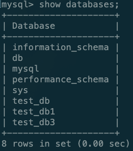

# 搭建RabbitMQ服务

在命令行输入以下命令

首先创建文件用于数据持久化

```text
mkdir -p /www/rabbitmq
```

```text
docker run -d --hostname rabbit-node1 --name rabbit-node1 -p 5671:5672 -p 15672:15672 -v /www/rabbitmq:/var/lib/rabbitmq rabbitmq:management
```

查看服务状态



确定服务正常启动后在浏览器输入网址[http://localhost:15672](http://localhost:15672/#/)，进入RabbitMQ的登陆界面


默认用户名密码都是guest。登陆之后就可以进入到主界面了


