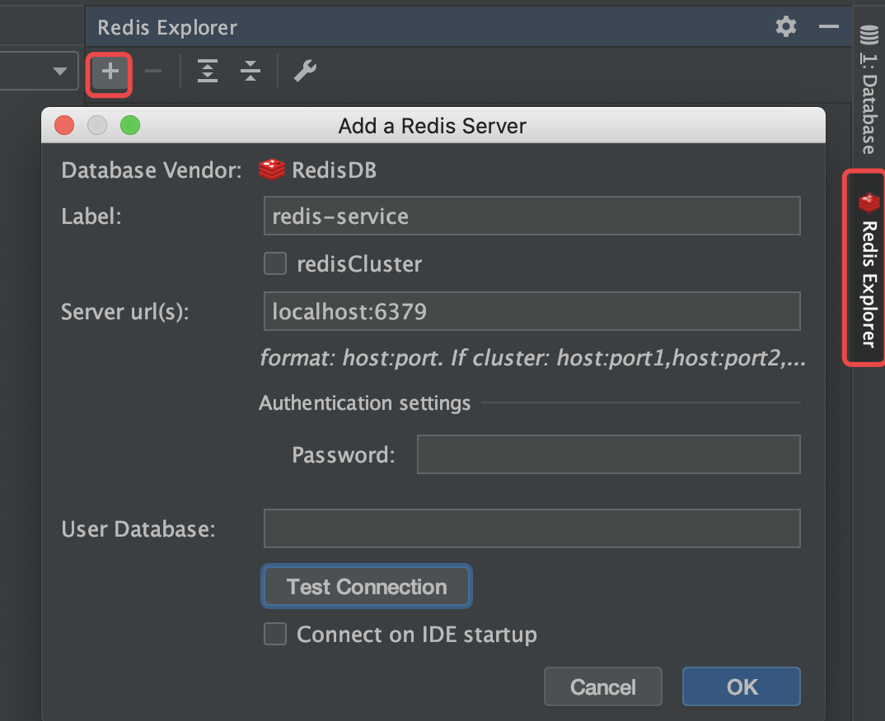

# 搭建redis服务

使用docker-compose的方式快速搭建起redis的环境

### 编写yml文件


```text
version: "3"

services:

  redis:
    image: redis
    ports: 
        - "6379:6379"
    volumes: 
        - redis-data:/data
        
volumes:
    redis-data: 
```


### 启动service

```text
docker-compose up -d
```

### 进入service

```text
docker-compose exec redis bash
```

这样我们就进入了redis的容器内，然后使用命令连接redis服务

```text
redis-cli
```


之后我们就可以对数据进行操作了


### DataGrip连接redis

DataGrip同样是IDEA系列的数据库管理工具，但是它不能直接连接redis，所以我们首先要安装redis插件：

之后按照图片中的配置连接我们的redis服务



默认我们的数据会存储在0号，双击对应的数据库就可以方便的查看内容了


