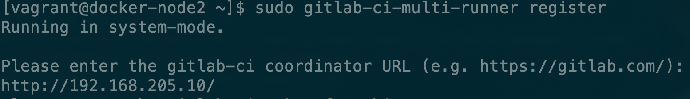
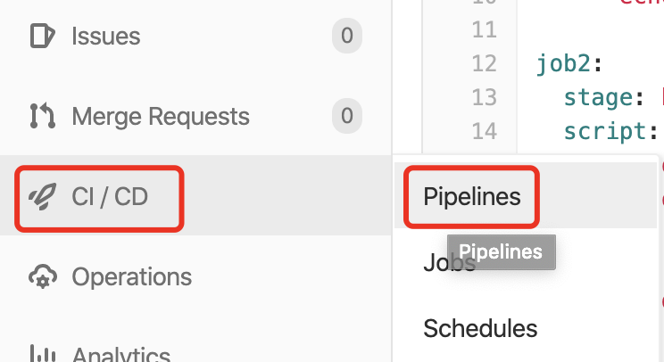

# Gitlab CI

GitLab CI/CD是一个内置在GitLab中的强大工具，它允许您将所有的持续方法\(持续集成、交付和部署\)应用到您的软件中，而不需要第三方应用程序或集成。

### 安装docker

```bash
curl -sSL https://get.docker.com/ | sh
```

### 安装gitlab ci runner

```bash
sudo gitlab-ci-multi-runner status
```

应该输出：gitlab-runner: Service is running!

### 设置docker权限

为了能让gitlab-runner能正确的执行docker命令，需要把gitlab-runner用户添加到docker group里, 然后重启docker和gitlab ci runner

```bash
sudo usermod -aG docker gitlab-runner
sudo service docker restart
sudo gitlab-ci-multi-runner restart
```

### **注册服务**

```bash
sudo gitlab-ci-multi-runner register
```

输入服务器地址



输入token，首先我们在gitlab上创建一个newProject项目，在项目的侧边栏进入Settings的CI/CD页面


回车确认后，在tag那里可以输入一些tag，`test,demo`，之后一路回车，在最后的时候选择shell作为执行。然后我们来看一下服务是否注册成功

```bash
sudo gitlab-ci-multi-runner list
```


接下来我们回到Gitlab刷新一下，重新进入CI/CD中的Runners，可以看到我们已经多了一个Runner


因为gitlab默认的域名是`gitlab.example.com`，所以我们要在gitlab-ci这台机器上修改一下hosts


并执行命令使其立即生效

```bash
sudo /etc/init.d/network restart
```

接下来我们如何使用这个gitlab-ci呢？首先我们要在项目中创建一个名`.gitlab-ci.yml`为的文件，可以直接在网页上创建文件，也可以通过push上传上去。

我们在这里直接在网页上创建文件


之后我们点击项目的CI/CD的piplines



接下来我们可以看到这个pipline的状态


点击进去可以看到我们这个pipline目前有三个任务


但是当前创建的任务并不知道该选择哪个ci-runner执行，所以需要修改我们的`.gitlab-ci.yml`文件，在每个job中输入tags


然后再来看一下每个job的状态


此时我们一个完整一个pipline的流程已经完成，接下来我们通过几个案例来加深一下使用。

Gitlab官方也提供了一些案例，大家也可以动手尝试一下：[GitLab CI/CD Examples](https://docs.gitlab.com/ee/ci/examples/README.html)

