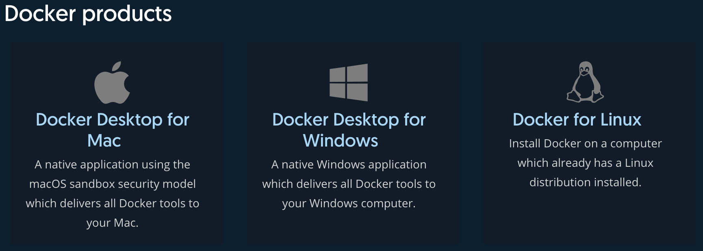

# Docker安装

关于Docker的安装较为简单，mac和windows都有对应的安装包，Linux上也有每一步详细的安装步骤。



详情请参考官网：[Docker文档官网](https://docs.docker.com/)

**TODO：完善安装部分，Nvidia-docker的安装。**

国内可能在下载镜像时较慢，可以使用国内镜像加速：

以CentOS7为例，请在 /etc/docker/daemon.json 中写入如下内容（如果文件不存在请新建该文件）

```text
{
  "registry-mirrors": [
    "https://dockerhub.azk8s.cn",
    "https://hub-mirror.c.163.com"
  ]
}
```

注意，一定要保证该文件符合 json 规范，否则 Docker 将不能启动。之后要重新启动Docker服务。

```bash
$ sudo systemctl daemon-reload
$ sudo systemctl restart docker
```

**若想要快速练习Docker，可以使用Docker在线版本：**[**Play with Docker**](https://labs.play-with-docker.com/)**，但是环境的保存时间有限。**

