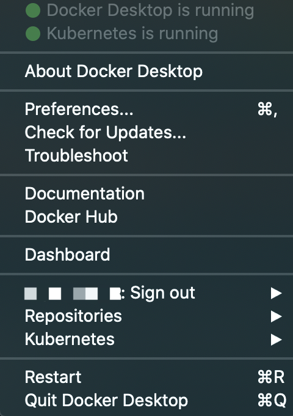

# Docker安装

### 安装

关于Docker的安装较为简单，mac和windows都有对应的安装包，Linux上也有每一步详细的安装步骤。


详情请参考官网：[Docker文档官网](https://docs.docker.com/)

## Centos安装

我们以centos为例进行docker的安装

### 卸载之前的版本

```bash
sudo yum remove docker \
                  docker-client \
                  docker-client-latest \
                  docker-common \
                  docker-latest \
                  docker-latest-logrotate \
                  docker-logrotate \
                  docker-engine
```

### 安装docker依赖环境

```bash
sudo yum install -y yum-utils \
  device-mapper-persistent-data \
  lvm2
```

### 安装Docker引擎

```bash
sudo yum install docker-ce
```

### 启动Docker服务

```bash
sudo systemctl start docker
```

查看是否安装成功

```bash
docker --version
```

或者运行

```bash
sudo docker run hello-world
```

正确安装会有输出


**TODO：Nvidia-docker的安装。**

### 国内镜像

国内可能在下载镜像时较慢，可以使用国内镜像加速：

以CentOS7为例，请在 /etc/docker/daemon.json 中写入如下内容（如果文件不存在请新建该文件）

```text
{
  "registry-mirrors": [
    "https://dockerhub.azk8s.cn",
    "https://hub-mirror.c.163.com"
  ]
}
```

注意，一定要保证该文件符合 json 规范，否则 Docker 将不能启动。之后要重新启动Docker服务。

```bash
$ sudo systemctl daemon-reload
$ sudo systemctl restart docker
```

### **Docker可视化**

最新版的Docker客户端提供了新的可视化功能，可以看到界面整洁干净了许多，更加方便易用。




