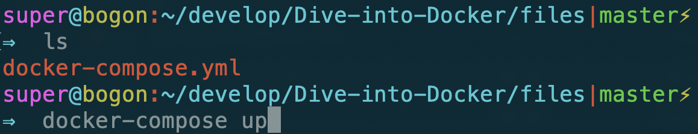
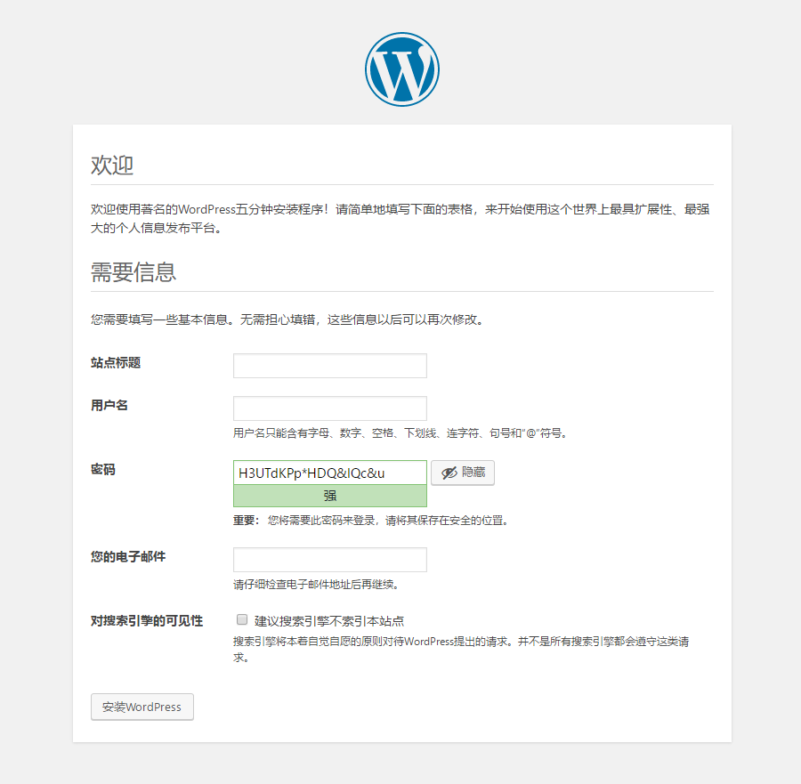

# Docker初体验

我们先尝个鲜，使用Docker部署一个wordpress环境。

首先在服务器上运行以下命令

```text
docker-compose --version
```

查看是否已经安装了Docker Compose。若没有安装请移步[Docker Compose安装](docker-duo-rong-qi-bu-shu/docker-compose-an-zhuang.md)，整体的安装过程也较为简单。

### 首先创建一个`docker-compose.yml`文件。


```text
version: '3'
​
services:
​
  wordpress:
    image: wordpress
    ports:
      - 8080:80
    depends_on:
      - mysql
    environment:
      WORDPRESS_DB_HOST: mysql
      WORDPRESS_DB_PASSWORD: root
    networks:
      - my-bridge
​
  mysql:
    image: mysql:5.7
    environment:
      MYSQL_ROOT_PASSWORD: root
      MYSQL_DATABASE: wordpress
    volumes:
      - mysql-data:/var/lib/mysql
    networks:
      - my-bridge
​
volumes:
  mysql-data:
​
networks:
  my-bridge:
    driver: bridge
```


然后在将终端切到文件所在的目录下。

### 执行`docker-compose up`命令



### 查看结果

等待安装完成后，在浏览器输入`执行命令的机器的ip地址:8000`就可以看到wordpress的安装界面。




再对比一下不使用Docker方式：[安装wordpress](https://codex.wordpress.org/zh-cn:%E5%AE%89%E8%A3%85_WordPress)。你就能立刻对比出使用Docker的好处，而且如果后期存在站点迁移或更换服务器等操作，使用传统方法的开销是巨大的。


