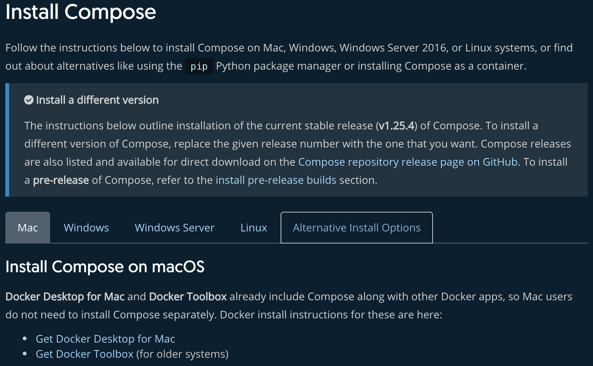
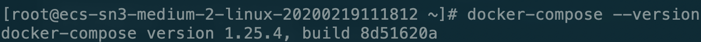

# Docker Compose安装

一般情况下在mac和windows上安装Docker时会自动安装docker-compose，Linux上需要手动安装。

首先通过命令

```bash
docker-compose --version
```

查看你的服务器是否已经安装好了Docker Compose。若没有安装则继续阅读以下[安装步骤](https://docs.docker.com/compose/install/)。



## Centos安装Docker-Compose

### 获取Docker-compose发行版

```bash
sudo curl -L "https://github.com/docker/compose/releases/download/1.25.4/docker-compose-$(uname -s)-$(uname -m)" -o /usr/local/bin/docker-compose
```

### 修改权限

```bash
sudo chmod +x /usr/local/bin/docker-compose
```

### 查看是否安装成功

```bash
docker-compose --version
```



