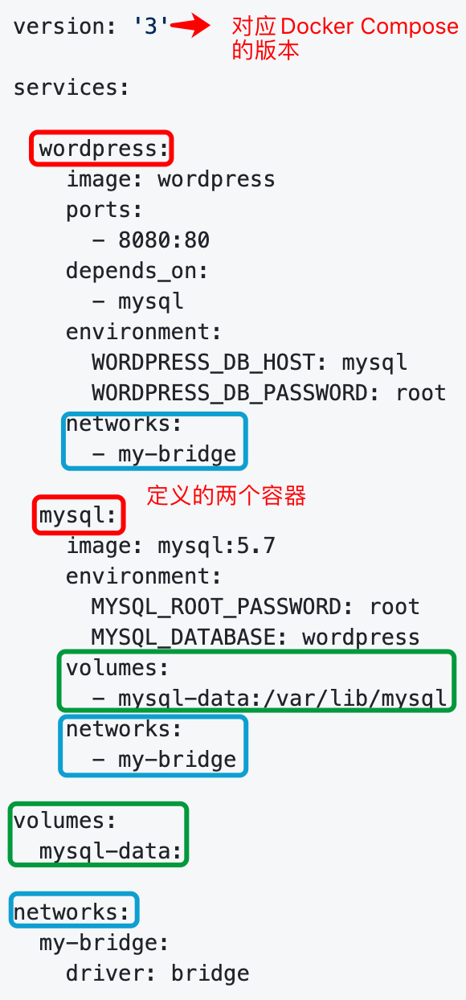

# Docker Compose

Docker Compose是一个工具，它支持通过yml文件来定义和配置多个容器，而且在定义好容器之后我们可以通过跟简单的命令快速的搭建起一个基于Docker的多容器应用。

默认情况下我们是创建一个`docker-compose.yml`文件，在这个文件中我们会定义三个比较重要的东西。

1. services：里面对应的每个service代表一个容器，容器对应的镜像可以通过DockerHub拉取，也可以通过build命令构建。并且在创建时我们还可以指定对应的network和volume。
2. volumes：对应之前Docker持久化存储那里的`-v`参数
3. networks：对应之前Docker网络那里的`-net`参数

其实我们在最开始的Docker初体验里就已经使用过这个Docker Compose了，不知道大家还记不记得，我们这里再回顾一下。

