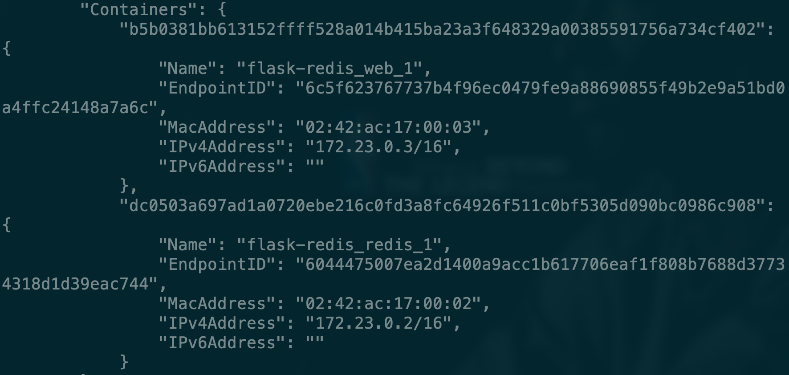
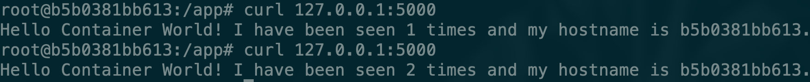

# flask-redis Docker Compose实战

我们在之前是使用docker的命令将flask和redis进行连接，详情见[flask-redis实战](../docker-wang-luo/flaskredis-shi-zhan.md)

接下来我们使用docker-compose的方式实现同样的功能。

### 编写python文件

首先编辑好一个python文件


```text
from flask import Flask
from redis import Redis
import os
import socket

app = Flask(__name__)
redis = Redis(host=os.environ.get('REDIS_HOST', '127.0.0.1'), port=6379)


@app.route('/')
def hello():
    redis.incr('hits')
    return 'Hello Container World! I have been seen %s times and my hostname is %s.\n' % (redis.get('hits'),socket.gethostname())


if __name__ == "__main__":
    app.run(host="0.0.0.0", port=5000, debug=True)
```


### 编写Dockerfile


```text
FROM python:2.7
LABEL maintaner="Peng Xiao xiaoquwl@gmail.com"
COPY . /app
WORKDIR /app
RUN pip install flask redis
EXPOSE 5000
CMD [ "python", "app.py" ]
```


### 编写docker-compose


```text
version: "3"

services:

  redis:
    image: redis

  web:
    build:
      context: .
      dockerfile: Dockerfile
    environment:
      REDIS_HOST: redis
```


可以看到在文件中我们定义了两个service，一个叫做redis，一个叫做web，而且web的镜像常见方式是build。

### 创建服务

```text
docker-compose up -d
```

可以看到这里我们也并没有像之前一样使用`--link`命令，是因为我们通过`docker-compose up`启动后会默认创建一个network。


我们再具体看一下网络中的具体内容，可以看到我们创建的两个service确实是连接到这个network中的。所以他们两个之间是可以直接通信的。



接下来我们访问一下，可以看到效果和之前是一样的



