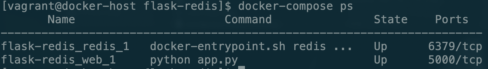
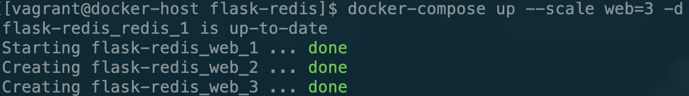
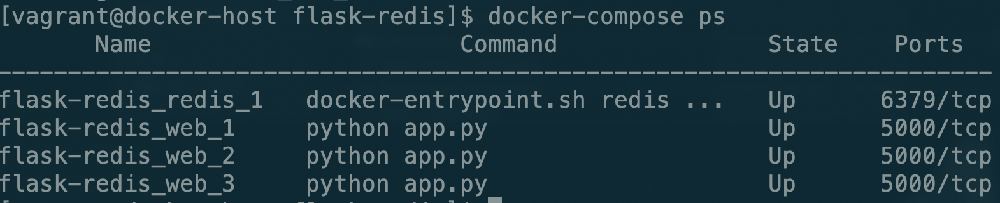

# 负载均衡

现在的需求是这样的，我们刚才创建的那个flask-redis服务因为访问的人多现在需要拓展几个容器来同时提供服务，以平衡单个容器的访问压力，我们如何实现这个需求呢？

我们先来看一下现在的情况



Docker Compose有一个scale参数，通过这个参数可以实现容器的水平拓展。

```bash
docker-compose up --scale web=3 -d
```



我们再通过命令查看一下现在的容器状态



现在可以看到我们有了三个web服务，这三个web会同时对外提供服务，以减轻访问单个容器的压力。

但是现在这样还有一个问题就是我们每个容器都是暴露出自己的端口5000，而且因为本地服务器只有一个8080端口，我们没法让多个容器绑定上去，那我们如何通过访问服务器的地址来自动的映射到其他容器呢？

这时我们就需要haproxy来支持，首先我们修改一下dokcer-compose.yml文件。

同时将app.py文件也做一些修改

现在我们来启动一下服务

```bash
docker-compose up -d
```

然后做一下水平拓展

```bash
docker-compose up --scale web=3 -d
```

现在来访问一下服务

