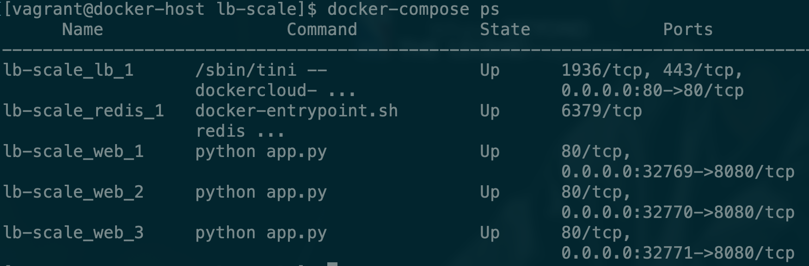

# 负载均衡

现在的需求是这样的，我们刚才创建的那个flask-redis服务因为访问的人多现在需要拓展几个容器来同时提供服务，以平衡单个容器的访问压力，我们如何实现这个需求呢？

### 水平拓展

我们先来看一下现在的情况


Docker Compose有一个scale参数，通过这个参数可以实现容器的水平拓展。

```bash
docker-compose up --scale web=3 -d
```


我们再通过命令查看一下现在的容器状态


现在可以看到我们有了三个web服务，这三个web会同时对外提供服务，以减轻访问单个容器的压力。

### 出现的问题

但是现在这样还有一个问题就是我们每个容器都是暴露出自己的端口5000，而且因为本地服务器只有一个8080端口，我们没法让多个容器都绑定上去，那我们如何通过访问服务器的地址来自动的映射到其他容器呢？

### 解决办法

这时我们就需要[haproxy](https://www.jianshu.com/p/c9f6d55288c0)来支持。

> HAProxy是一个免费的负载均衡软件，可以运行于大部分主流的Linux操作系统上。
>
> HAProxy提供了L4\(TCP\)和L7\(HTTP\)两种负载均衡能力，具备丰富的功能。HAProxy的社区非常活跃，版本更新快速（最新稳定版1.7.2于2017/01/13推出）。最关键的是，HAProxy具备媲美商用负载均衡器的性能和稳定性。
>
> 因为HAProxy的上述优点，它当前不仅仅是免费负载均衡软件的首选，更几乎成为了唯一选择。

### 修改`dokcer-compose.yml`文件。

```bash
version: "3"

services:

  redis:
    image: redis

  web:
    build:
      context: .
      dockerfile: Dockerfile
    ports: ["8080"]
    environment:
      REDIS_HOST: redis

  lb:
    image: dockercloud/haproxy
    links:
      - web
    ports:
      - 80:80
    volumes:
      - /var/run/docker.sock:/var/run/docker.sock 
```

### 修改app.py

```bash
from flask import Flask
from redis import Redis
import os
import socket

app = Flask(__name__)
redis = Redis(host=os.environ.get('REDIS_HOST', '127.0.0.1'), port=6379)


@app.route('/')
def hello():
    redis.incr('hits')
    return 'Hello Container World! I have been seen %s times and my hostname is %s.\n' % (redis.get('hits'),socket.gethostname())


if __name__ == "__main__":
    app.run(host="0.0.0.0", port=80, debug=True)
```

### 修改Dockerfile

```bash
FROM python:2.7
LABEL maintaner="Peng Xiao xiaoquwl@gmail.com"
COPY . /app
WORKDIR /app
RUN pip install flask redis
EXPOSE 80
CMD [ "python", "app.py" ]
```

### 启动服务

```bash
docker-compose up -d
```

### 做水平拓展

```bash
docker-compose up --scale web=3 -d
```

我们先看一下service的具体情况



现在来访问一下服务


可以看到我们在访问的过程中是近乎轮询式的，通过这样的方式来减轻单个服务器的压力，实现负载均衡。

