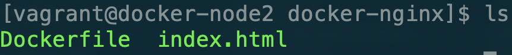
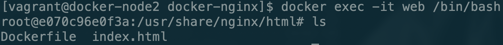
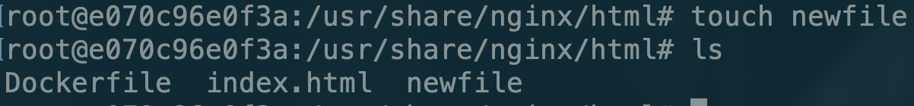

# Bind Mouting管理Volume

接下来我们介绍下一种持久化的存储方式：Bind Mouting。这种方式不需要我们在Dockerfile中创建volume，而是在启动容器时直接指定服务器的文件路径和要映射容器内的文件路径。

这里我们使用nginx来演示这种持久化方式：

首先我们来创建一个Dockerfile

```text
FROM nginx:latest
WORKDIR /usr/share/nginx/html
COPY index.html index.html
```

接下来通过这个Dockerfile构建一下镜像

```bash
docker build -t su/my-nginx .
```

之后启动容器

```bash
docker run -d -v $(pwd):/usr/share/nginx/html -p 80:80 --name web su/my-nginx
```

我们是将当前的文件夹挂载容器中



接下来我们进到容器中看一下

```bash
docker exec -it web /bin/bash
```

此时在容器中我们新创建一个文件





这时我们再回到服务器中查看一下


可以看到容器和服务器他们两个是同步的。这样的好处就是我们并不需要进入到容器中进行编辑文件，我们只需要在服务器上编辑文件就可以将修改同步到容器中实时的提供服务。

