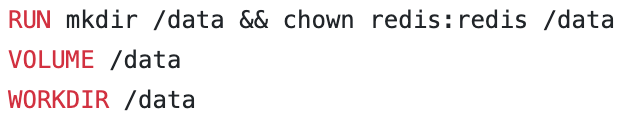
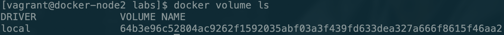
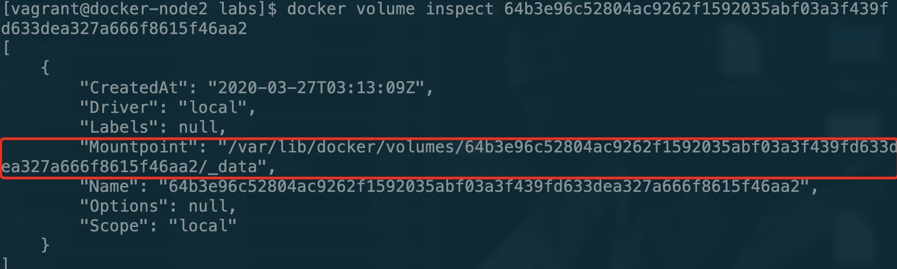
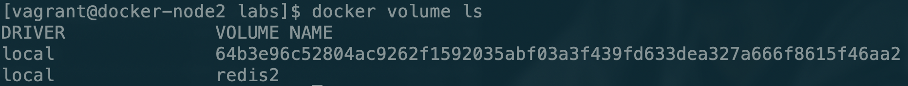

# Docker自动管理Volume

接下来我们以redis为例

我们先看一下redis的[Dockerfile](https://github.com/docker-library/mysql/blob/d284e15821ac64b6eda1b146775bf4b6f4844077/5.7/Dockerfile)，在其中它指定了对应的Volume



之后我们在服务器上创建一个redis容器

```bash
docker run -d --name redis redis
```

接下来我们使用命令查看一下容器中的Volume

```bash
docker volume ls
```

可以看到通过创建redis镜像已经为我们自动创建了一个volume



我们也可以使用inspect来查看一下vloume的具体细节\(后面记得修改为自己的VOLUME NAME\)

```bash
docker volume inspect 64b3
```

可以看到它自动将/data挂载到的服务器路径



如果此时我们将容器删除，**但是查看volume它仍然存在**。但是这个VOLUME NAME的名字因为是随机的，看起来非常不方便，所以我们可以在创建容器时为他指定名称

```bash
docker run -d -v redis2:/data --name redis2 redis
```

之后我们再次查看一下对应的volume，他的VOLUME NAME已经修改为我们指定的名字



然后大家可以尝试一下在redis中创建一些数据，然后将当前的redis容器删除，再重新启动一个redis并挂载到原来的文件路径上，看一下redis中的数据是否仍然存在。

