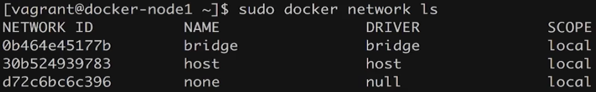
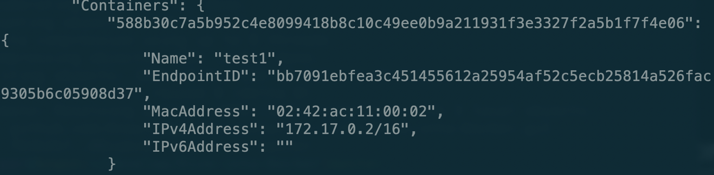
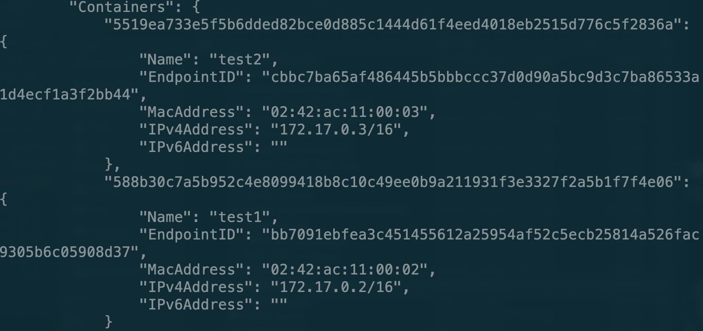
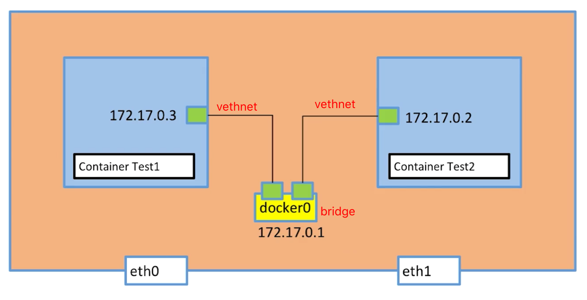
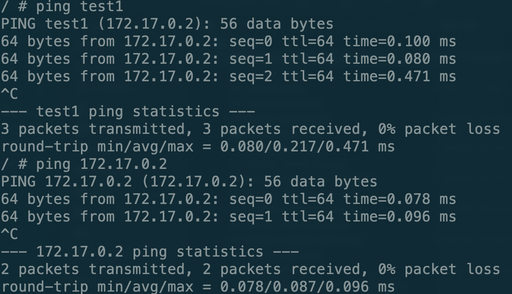

# Docker单机网络

关于网络基础知识大家请系统学习计算机网络相关内容。

这里介绍两个几个常用命令：

* ping：查看指定IP是否可达 `ping 192.168.0.1`。
* telnet：查看服务是否可用 `telnet 192.168.0.1 80`，有的地址不可以ping但是可以用telnet验证服务是否可用。
* curl：用来请求 Web 服务器。它的名字就是客户端（client）的 URL 工具的意思。
* wget：一个下载文件的工具。
* ip a：显示IP地址。

查看docker的网络：

```bash
docker network ls
```

可以看到在docker中有三种网络：



默认情况下容器使用的是桥接也就是Bridge Network，之后我们启动一个容器并查看网络具体内容

```bash
docker run -d --name test1 busybox /bin/sh -c "while true;do sleep 3600;done"
```

```bash
docker inspect 0b464e45177b(改成你查看到的NETWORK ID)
```

在network的具体细节内我们可以看到在containers中包含了我们刚才创建的容器



可以看到我们当前的容器是连接到了bridge的网络中。在我们的主机和容器之间会创建一对vethnet以便于容器和主机之间相互通信，在主机的终端上我们可以直接ping通容器的ip地址。

这时我们再创建一个容器

```bash
docker run -d --name test2 busybox /bin/sh -c "while true;do sleep 3600;done"
```

再次查看network的具体内容



同时test2也会创建一堆vethnet，test1和test2的vethnet端口会都连接在一个bridge上，所以他们两个之间可以相互ping通。



在已经知道了两个容器之间可以相互访问的情况下，我们现在需要实现这样一个需求：

* 首先启动另一个容器db，在这个容器上运行数据库服务
* 同时启动一个容器web，这个容器中我们可以运行一个用户注册服务
* 用户点击注册后，web容器将数据存储到dbrongqi中

以上的这个操作必然要涉及两个容器的网络链接，我们知道可以通过IP地址相互ping通，但是在大规模集群的情况下不可能手动的去指定IP，这个时候我们如何让这两个容器知道对方的存在呢？

我们可以在创建容器时使用`--link`参数，来制定我们创建的这个容器要连接到哪个容器上。

```bash
docker run -d --name test2 --link test1 busybox /bin/sh -c "while true;do sleep 3600;done"
```

之后我们进入test2中，`ping test1`的IP地址和test1都可以ping通。也就是我们在使用`--link`时是创建的DNS服务，将test1映射到172.17.0.2上。



我们也可以手动创建一个network，在创建容器时将容器连接到我们自己创建的network上，此时如果我们在自建的网络上创建两个容器，他们两个之间是默认`link`好的。

