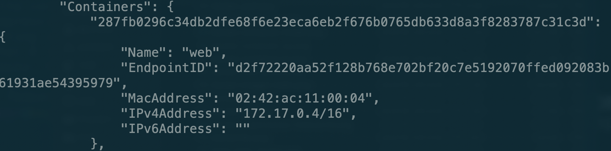
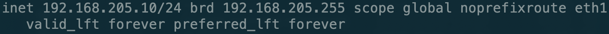
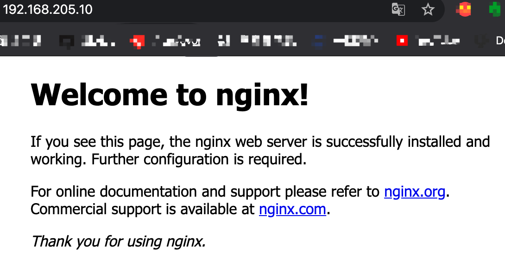

# Docker端口映射

我们启动一个容器里面一定会运行一些服务，但是这些服务我们如何才能让外界访问到呢？首先肯定是连接好网络，这之前我们已经说过了。另一个重要的就是端口映射。

假如说我们在服务器上启动nginx的服务，他默认是通过80端口来访问的，但是我们如何通过访问服务器的80端口来默认的访问到容器中的nginx服务呢？我们在运行容器时可以使用这个命令：

```bash
docker run --name web -d -p 80:80 nginx
```

我们通过-p参数来将容器的80端口映射到服务器的80端口上，这样我们访问服务器的80端口时就会直接请求nginx服务。

我们容器的IP地址：



Linux服务器的IP地址分别是：



然后我们访问Linux服务器的80端口：



可以看到确实是可以成功映射的。

