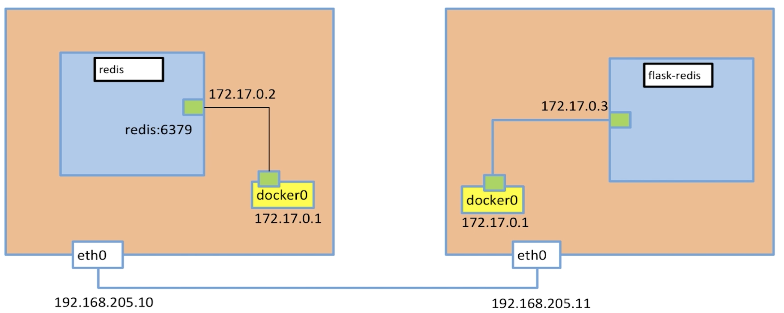

# Docker多机网络

刚才我们已经成功的实现了flask-redis应用程序，但是还存在一个问题，我们的服务可能是访问量很大的一个服务，这时需要我们将redis和flask部署到不同的服务器上，我们怎么才能让这两个部署在不同服务器上的容器相互通信呢？

两个容器之间数据的传递使用的技术是VXLAN，他是一个overlay网络的实现，更多内容可以参考：[关于VLAN和VXLAN的理解](https://blog.csdn.net/octopusflying/article/details/77609199)。

想要实现两个容器进行通信我们需要一个技术来支持就是etcd，关于etcd的更多内容大家可以查看：[Etcd 使用入门](https://www.hi-linux.com/posts/40915.html)，[高可用分布式存储 etcd 的实现原理](https://draveness.me/etcd-introduction)。etcd 的官方将它定位成一个可信赖的分布式键值存储服务，它能够为整个分布式集群存储一些关键数据，协助分布式集群的正常运转。也就是我们的两台服务器要分别在etcd服务上进行注册，以便于互相识别。

