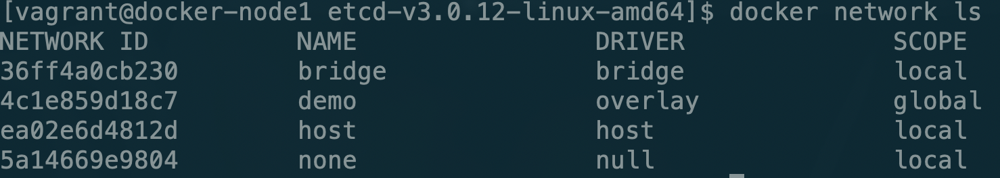

# flask-redis多机实战

接下来我们将之前的那个flask-redis实战转换为多机的实战

首先准备两台服务器，我这里准备了两台服务器分别是node1和node2，他们的ip地址分别是：`192.168.205.10`和`192.168.205.11`

### 安装etcd服务

我们首先在两个节点上安装etcd服务。

首先在node1节点上运行命令

```bash
vagrant@node1:~$ wget https://github.com/coreos/etcd/releases/download/v3.0.12/etcd-v3.0.12-linux-amd64.tar.gz
vagrant@node1:~$ tar zxvf etcd-v3.0.12-linux-amd64.tar.gz
vagrant@node1:~$ cd etcd-v3.0.12-linux-amd64
vagrant@node1:~$ nohup ./etcd --name docker-node1 --initial-advertise-peer-urls http://192.168.205.10:2380 \
--listen-peer-urls http://192.168.205.10:2380 \
--listen-client-urls http://192.168.205.10:2379,http://127.0.0.1:2379 \
--advertise-client-urls http://192.168.205.10:2379 \
--initial-cluster-token etcd-cluster \
--initial-cluster docker-node1=http://192.168.205.10:2380,docker-node2=http://192.168.205.11:2380 \
--initial-cluster-state new&
```

之后在node2上运行命令

```bash
vagrant@node2:~$ wget https://github.com/coreos/etcd/releases/download/v3.0.12/etcd-v3.0.12-linux-amd64.tar.gz
vagrant@node2:~$ tar zxvf etcd-v3.0.12-linux-amd64.tar.gz
vagrant@node2:~$ cd etcd-v3.0.12-linux-amd64/
vagrant@node2:~$ nohup ./etcd --name docker-node2 --initial-advertise-peer-urls http://192.168.205.11:2380 \
--listen-peer-urls http://192.168.205.11:2380 \
--listen-client-urls http://192.168.205.11:2379,http://127.0.0.1:2379 \
--advertise-client-urls http://192.168.205.11:2379 \
--initial-cluster-token etcd-cluster \
--initial-cluster docker-node1=http://192.168.205.10:2380,docker-node2=http://192.168.205.11:23
```

检查一下etcd的状态：

```bash
vagrant@node2:~/etcd-v3.0.12-linux-amd64$ ./etcdctl cluster-health
```

### 重启docker服务

在node1上运行命令

```bash
sudo service docker stop
sudo /usr/bin/dockerd -H tcp://0.0.0.0:2375 -H unix:///var/run/docker.sock --cluster-store=etcd://192.168.205.10:2379 --cluster-advertise=192.168.205.10:2375&
```

在node2上运行命令

```bash
sudo service docker stop
sudo /usr/bin/dockerd -H tcp://0.0.0.0:2375 -H unix:///var/run/docker.sock --cluster-store=etcd://192.168.205.11:2379 --cluster-advertise=192.168.205.11:2375&
```

接下来我们在node1上创建一个名为demo的overlay网络

```bash
docker network create -d overlay demo
```

我们现在在node1和node2上查看一下网络情况




我们虽然没有在node2上创建demo网络，但是通过etcd会同步的进行创建，这样我们两台服务器上都有了一个叫做demo的网络，接下来我们创建容器时就可以将demo作为容器的网络。

### 加载容器

首先在node2上创建redis容器

```bash
docker run -d --name redis --net demo redis
```

接下来在node1上创建flask容器

```bash
docker run -d --net demo -p 5000:5000 --name flask-redis -e REDIS_HOST=redis su/flask-redis
```

接下来我们看一下实验结果


在访问一次


可以看到我们已经实现了多容器应用的多机部署💯。

