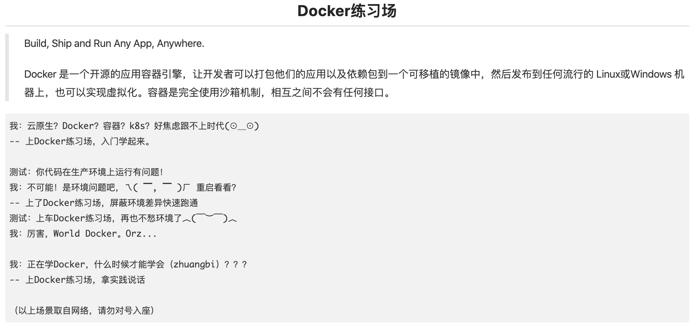

# Docker练习场

学习完以上内容，大家可以参加一下阿里天池的[Docker练习场](https://tianchi.aliyun.com/competition/entrance/231759/introduction)比赛，更进一步熟悉Docker操作。

而且天池也为大家准备非常详细的教程：[手把手超详细操作说明](https://tianchi.aliyun.com/competition/entrance/231759/tab/174)

我的提交：



