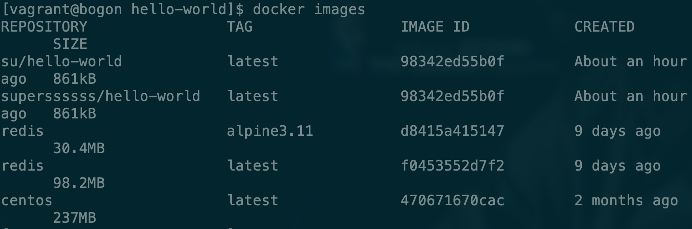
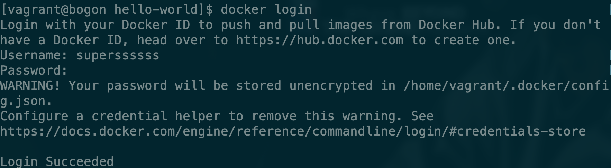
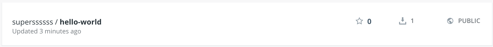
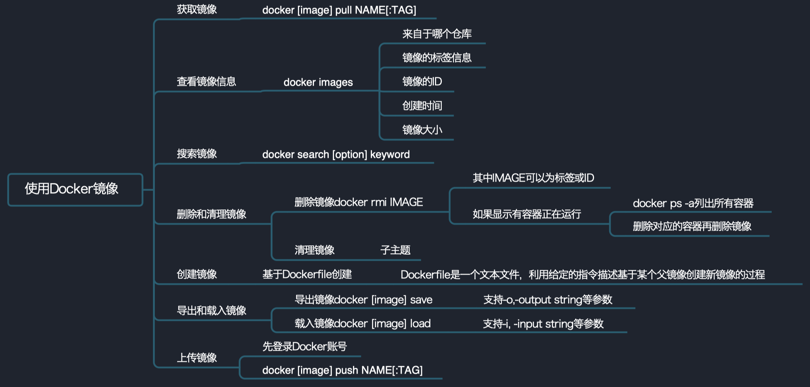

# 发布image

为了将我们自己创建的image发布，我们需要在[Docker Hub](https://hub.docker.com/)上注册账号，并且在生成镜像时，-t后面要接Docker Hub用户名/镜像名称。我们已经生成了一个新的superssssss/hello world镜像。



首先通过docker login命令登陆。



推送自己的镜像到Docker Hub上

```bash
docker push superssssss/hello-world:latest
```

**注意你在使用过程中需要将superssssss修改为自己的账户名，`:`后面接的是镜像版本。**



我们就可以在Docker Hub上查看到刚才push上去的镜像了。



