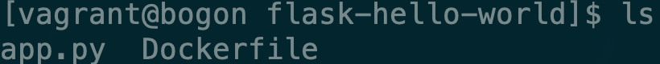

# flask案例实战

本案例我们使用python的flask框架搭建一个简易的可访问的网站。

### 编写python文件

首先编写python程序，文件名为app.py

```python
from flask import Flask
app = Flask(__name__)
@app.route('/')
def hello():
    return "hello docker\n"
if __name__ == '__main__':
    app.run(host="0.0.0.0", port=5000)
```

### 编写Dockerfile

之后编写Dockerfile文件


```text
FROM python:2.7
LABEL maintainer="123<123@gmail.com>"
RUN pip install flask
COPY app.py /app/
WORKDIR /app
EXPOSE 5000
CMD ["python", "app.py"]
```


这个Dockerfile包含更多的内容，我们这个Dockerfile是以`python:2.7`为基础镜像，其中`maintainer`为此Dockerfile文件的维护人员，方便其他使用者联系。接下来的`RUN`命令安装了flask框架，`COPY`命令将文件夹下的app.py拷贝到镜像文件下的`/app/`目录下，并通过`WORKDIR`命令将当前的工作目录设置为`/app`，并将镜像的5000端口`EXPOSE`开放出去提供访问，最后的`CMD`命令执行这个app.py文件。我们来看一下现在文件夹下存在哪些内容



### 构建镜像

然后构建一下镜像，需要一段时间。

```bash
docker build -t superssssss/flask-hello .
```

### 加载容器

然后我们将镜像加载为容器运行

```bash
docker run -d -p 5000:5000 superssssss/flask-hello
```

`-p`参数将容器的5000[端口映射](../docker-wang-luo/docker-duan-kou-ying-she.md)到电脑的5000端口，这样通过`电脑的ip地址:5000`就可以访问这个容器提供的服务了。


