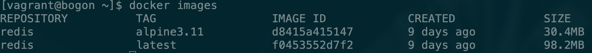
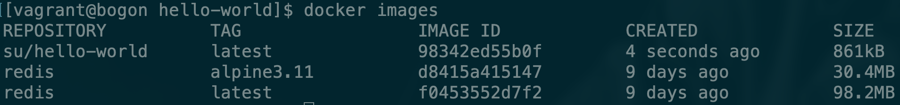

# 如何获取image


* 通过`docker pull`从远程仓库拉取镜像
* 通过Dockerfile构建镜像

### docker pull拉取镜像

使用docker pull方式例如我们想获取redis的镜像，我们可以通过命令

```bash
docker pull redis
```

我们在拉取镜像时也可以指定版本号，否则默认是拉取最新的latest镜像。

```bash
docker pull redis:alpine3.11
```

通过docker images再显示拉取下来的镜像



### 使用Dockerfile构建镜像

我们这里使用c语言编写一个hello world程序，之后将该程序打包到Docker image中。

首先创建单独的文件夹存放与Dockerfile相关的文件,创建hello.c文件，并将其编译为可执行文件hello

```c
#include<stdio.h>

int main(){
    printf("Hello World\n");
}
```

使用命令进行编译。在centos上通过命令安装编译环境：

```bash
sudo yum install gcc
sudo yum install glibc-static
```

将文件编译为可执行文件

```bash
gcc -static ello.c -o hello
```

创建并编辑Dockerfile内容（此处的文件并不规范，仅作为快速上手使用）


```text
FROM scratch
ADD hello /
CMD ["/hello"]
```


现在我们来看一下目录下的所有文件


根据此Dockerfile创建镜像

```bash
docker build -t su/hello-world .
```

其中`-t`之后代表我们要生成镜像的标记，最后有一个`.`不要忘记，代表当前文件夹下。

我们再使用docker images便可以查看到我们刚才创建的image。



关于更多Dockerfile语法规则请查看：[Dockerfile 指令详解](https://yeasy.gitbooks.io/docker_practice/image/dockerfile/)

