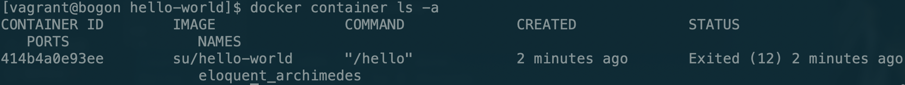

# 生成container并进入container

我们先加载一下刚才我们自己创建的image，通过一下命令运行

```bash
docker run su/hello-world
```

我们可以看到输出结果


刚才使用`docker run`命令就是将我们创建的hello-world镜像加载成容器运行。

我们通过以下命令都可以查看到container的运行情况

```bash
docker container ls -a
```

```bash
docker ps -a
```

因为通过此方式刚才的docker run方式创建的容器终端会一直打印容器的log，如果我们使用`control+c`，这样会将刚才创建的容器一起停止。

查看容器默认是只显示运行中的容器，查看包括停止的容器需要加上`-a`参数。



🍔 🍔 🍔 

我们在来看一个centos的案例。

```bash
docker run -d centos /bin/bash
```

我们本地虽然没有centos的镜像，但是如果我们直接run的话，docker会自动从网上将centos的镜像拉取下来，并加载成容器，其中的`-d`参数会使当前的容器转为后台执行，这样我们可以继续进行其他操作，我们可以使用命令来查看一下容器状态。


在`STATUS`一栏可以查看容器的状态，现在centos这个镜像是`UP`状态。然后再通过`docker exec`命令进入容器

```bash
docker exec -it b6a /bin/bash
```

其中`-it`参数可以使终端以交互式的运行，并执行`/bin/bash`命令，b6a就可以代表这个centos容器对应的CONTAINER ID。


进入容器之后我们就可以对容器内的一些环境做一些修改。

在终端中输入`exit`退出容器。

