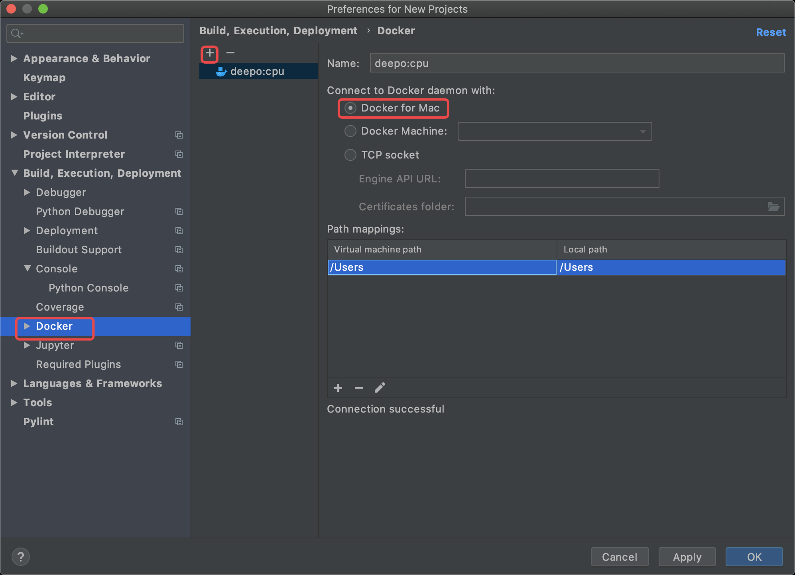

# PyCharm配置Docker

我想对于每一个开发者来说，最初的配置环境是一件非常头疼的事情，不仅有很多的软件要安装还有很多环境变量要配置。好不容易弄好的环境，放到别人的电脑上还不好使 😡 。现在我们有了docker就再也不用担心环境变量的配置了。


我们本节要使用mac+windows搭建起自己的深度学习开发环境。


### 前提条件

1. 电脑已安装docker。
2. docker服务已经启动。

### 选择深度学习的docker镜像

在Docker的官方的registry里（可以理解为装满docker镜像的市场），提供了许多镜像，其中包括：

1. [pytorch](https://hub.docker.com/r/pytorch/pytorch/)
2. [keras-jupyter](https://hub.docker.com/r/ermaker/keras-jupyter)
3. [tensorflow](https://hub.docker.com/r/tensorflow/tensorflow)

我们可以直接下载这些镜像并在本地将其加载为容器（不懂没关系，照着命令敲也一样），这样我们的开发环境就搭建好了，很方便有没有？

但是我们这里选择一个更方便的镜像：[deepo](https://github.com/ufoym/deepo)。这个镜像是国人做的一款针对深度学习的镜像，里面包含了当下许多流行的框架。

```python
>>> import tensorflow
>>> import sonnet
>>> import torch
>>> import keras
>>> import mxnet
>>> import cntk
>>> import chainer
>>> import theano
>>> import lasagne
>>> import caffe
>>> import caffe2
```

我们接下来就使用这个镜像搭建我们的开发环境。

### 拉取镜像

因为我的电脑是mac，不支持gpu版本，所以我们直接拉取CPU版本镜像。

```python
docker pull ufoym/deepo:cpu
```

如果你的电脑支持GPU那么可以拉取GPU版本镜像

```python
docker pull registry.docker-cn.com/ufoym/deepo
```

### 加载容器

对于CPU版本，我们使用这个命令

```python
docker run -it -v /host/data:/data -v /host/config:/config ufoym/deepo:cpu bash
```

其中我们使用-v参数做了[数据的持久化存储](docker-shu-ju-chi-jiu-hua-cun-chu/)。

对于GPU版本我们使用这个命令

```python
docker run --gpus all -it -v /host/data:/data -v /host/config:/config ufoym/deepo bash
```

若不习惯PyCharm也可以使用jupyter notebook。

```python
docker run --gpus all -it -p 8888:8888 --ipc=host ufoym/deepo jupyter notebook --no-browser --ip=0.0.0.0 --allow-root --NotebookApp.token= --notebook-dir='/root'
```

这样我们访问本地的localhost的8888端口就是访问到docker容器内的jupyter notebook，因为这里的-p参数做了端口的映射。

### 使用容器

现在我们的深度学习环境已经搭建好了，接下来我们直接使用这个容器

#### Mac使用Docker

对于mac来说，在PyCharm上使用docker非常简单，在preferences中选择Docker，然后选择Docker for Mac就可以。我们在Mac中不用执行上一步手动的加载容器，PyCharm会自动的为我们加载容器。



接下来就像本地搭建的开发环境一样运行程序即可。

#### Windows使用Docker

TODO

### 总结

对于搭建好的开发环境，如果未来我们需要迁移到别的机器上进行开发，很简单，只需要将我们当前的这个镜像拷贝到新的机器上即可实现迁移，再也不用为搭建开发环境而苦恼了。

